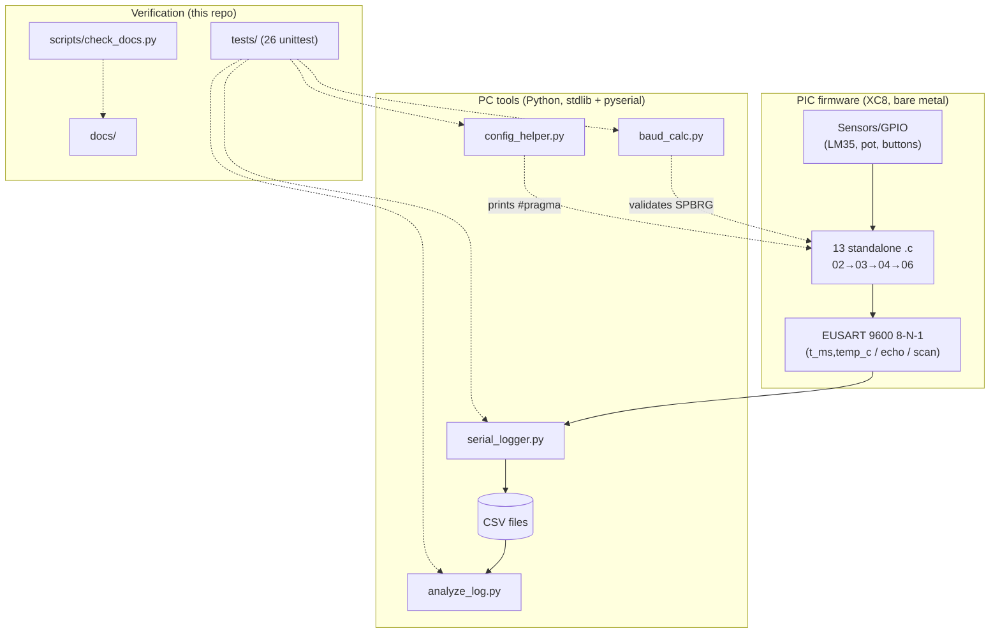

# ARCHITECTURE

> Code-grounded overview. Subsystem detail: [system-overview](architecture/system-overview.md) ·
> [application-flow](architecture/application-flow.md) · [data-flow](architecture/data-flow.md) ·
> [state](architecture/state-management.md) · [errors](architecture/error-handling.md) ·
> [decisions](architecture/decisions.md).

## 1. High-level architecture

Two independent halves joined by one narrow interface (UART text):

There is no server, database, auth, UI, or network. "API" = [UART protocol](api/uart-protocol.md);
"storage" = [on-chip EEPROM + CSV](database/schema.md).

## 2. Subsystems & responsibilities

| Subsystem | Location | Responsibility | Communicates via |
|---|---|---|---|
| Learning guides | `01-docs/` + stage READMEs | Teach concepts, wiring, math | Human reading order 01→06 |
| Firmware examples | `02-basics/`, `03-intermediate/`, `04-advanced/` | One peripheral/pattern per standalone file | Nothing (each is `main()` alone) |
| Capstone firmware | `06-projects/temp_logger_16f877a.c` | ADC+Timer0+UART CSV stream @2 Hz | UART TX → USB-UART |
| Capture | `05-python-tools/serial_logger.py` | UART → console + timestamped CSV | Serial port in, CSV file out |
| Analysis | `06-projects/analyze_log.py` | CSV → stats + ASCII chart | CSV file in, stdout out |
| Calc/helper | `baud_calc.py`, `config_helper.py` | Pre-flash validation + config text | stdout (human copy-paste) |
| Tests | `tests/` | Regression-proof the tools | subprocess + `importlib` |
| Docs | `docs/` | This engineering system | Markdown links (checked) |

Module docs: [firmware-basics](modules/firmware-basics.md) · [intermediate](modules/firmware-intermediate.md) ·
[advanced](modules/firmware-advanced.md) · [capstone](modules/capstone-system.md) ·
[python-tools](modules/python-tools.md) · [learning-guides](modules/learning-guides.md).

## 3. Flows

- **Data flow:** LM35 → AN0 → ADC → `uart_putdec16` → UART → USB-UART →
  `serial_logger` → CSV → `parse_rows` → stats/chart. Full path:
  [data-flow](architecture/data-flow.md). Single producer, single consumer, no branches.
- **Control flow:** firmware = init → `while(1)` (polling or ISR-flag);
  tools = parse args → validate → do work → exit code. See
  [application-flow](architecture/application-flow.md).
- **State:** firmware keeps ISR counters/`ms_ticks` in RAM (lost on reset)
  + 1 byte settings/counter in EEPROM (survives); tools are stateless
  except the appended CSV. See [state-management](architecture/state-management.md).
- **Errors:** firmware resets OERR locally / checks ACKSTAT; tools print
  `ERROR:` to stderr + exit 1/2/3. No error is silently swallowed. See
  [error-handling](architecture/error-handling.md) and [TESTING](TESTING.md#exit-codes).
- **Init/shutdown:** firmware runs from reset vector (configs → `main`);
  no shutdown (power off). Tools init = argparse; shutdown = Ctrl+C/exit code.

## 4. Constraints, assumptions, debt

- **Constraint:** each `.c` must stay a single paste-and-build file (duplicated
  UART helpers are intentional — see [decisions](architecture/decisions.md#d2)).
- **Constraint:** zero new Python dependencies (stdlib + pyserial only).
- **Assumption:** 20 MHz crystal on 16F877A examples; 8 MHz HFINTOSC on 18345
  examples. `_XTAL_FREQ` must equal reality or timing/UART breaks.
- **Assumption:** 5 V supply, common GNDs, 4.7k I2C pull-ups, 10k MCLR pull-up.
- **Debt (accepted):** firmware audit-verified, never compiled in CI (no XC8
  here); 18F45K22 config-starter only; serial-live tests skip without hardware.
- **Do not casually change:** pin assignments, config blocks, UART 9600 default,
  CSV column layout (producer + consumer + tests depend on it).

## 5. Traceability

Implementation: [`02-basics/`](../02-basics/README.md) ·
[`03-intermediate/`](../03-intermediate/README.md) · [`04-advanced/`](../04-advanced/README.md) ·
[`05-python-tools/`](../05-python-tools/README.md) · [`06-projects/`](../06-projects/README.md) ·
[`tests/`](../tests/__init__.py) · [`scripts/check_docs.py`](../scripts/check_docs.py).
