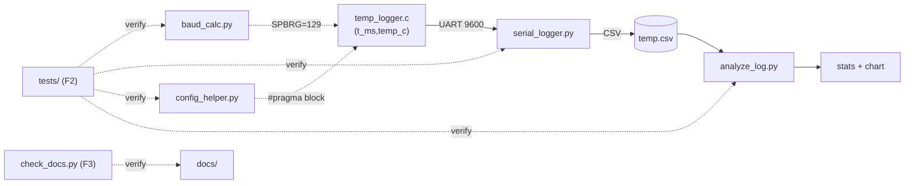

# STEP 4 — Refinement Design (minimal, practical, no gold-plating)

> Scope: `PIC-MCU-Programming/` only. Firmware behavior is FROZEN (verified
> correct in ANALYSIS.md); refinement targets PC-side robustness, tests,
> docs-verification, and engineering documentation.

## 1. Goals / non-goals

Goals: friendly CLI errors + sane exit codes; real automated tests for all
Python tools; a docs link-checker; exhaustive code-grounded `docs/`.
Non-goals: no firmware changes (pins, timing, structure); no new dependencies;
no shared Python package (each tool stays a copy-one-file-and-run script);
no invented features; no web UI/API/database fiction in docs.

## 2. Changes (STEP 6 features, one at a time)

- **F1 — CLI hardening:** validate `--fosc/--baud/--seconds` (> 0); catch
  `SerialException` on open + mid-run disconnect; catch `OSError` on CSV
  open/read. Exit codes: `0` ok · `1` environment/no-data · `2` usage/bad
  input · `3` serial device failure. Messages: `ERROR: <what> + hint`.
- **F2 — `tests/` (stdlib `unittest`, zero new deps):** pure-function tests
  via `importlib` file loading (dirs contain `-`, not importable) +
  black-box CLI tests via `subprocess`. Hardware/pyserial tests skip cleanly
  when unavailable. Covers E1–E4 regressions + baud math + CSV parsing.
- **F3 — `scripts/check_docs.py`:** fails on broken relative doc links or
  missing referenced `.c/.py` files; warns on unreferenced sources.

## 3. Decisions (rationale recorded; details → `decisions.md` in STEP 9)

1. Keep tools standalone (no `common/` package): copy-one-file usability beats
   DRY for 4 tiny scripts; duplication is 3-line arg checks, not logic.
2. `unittest` over pytest: stdlib = zero new deps, runs everywhere.
3. subprocess CLI tests over mocking pyserial: tests the real user path;
   skip (don't fake) hardware-dependent cases.
4. No firmware edits at all: audit-passing code + no compiler here = any edit
   is unverifiable risk. Docs will state this honestly.
5. Docs adapt the template to reality: UART protocol = `api/`; EEPROM+CSV =
   `database/`; UI sections marked N/A with reasons, never invented.

## 4. Risks

- R1: no XC8 here → firmware verified by audit only (accepted, documented).
- R2: no pyserial/hardware here → serial tests skip (accepted, documented).
- R3: doc volume tempts invention → every claim traced to a file (STEP 11).

## 5. Test strategy

`python -m unittest discover -s tests` (STEP 10) + `check_docs.py` +
tool `--help` smoke + baud↔firmware SPBRG cross-check + synthetic-CSV
pipeline run. Pass criteria: all runnable tests green, 0 broken links.

## 6. STEP 4 checkpoint

Design matches the existing project, adds no deps, duplicates nothing,
integration (UART/CSV) untouched. Risks identified. Ready for STEP 5/6.
