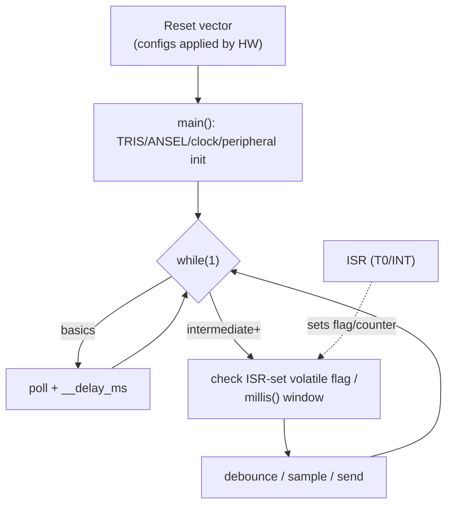
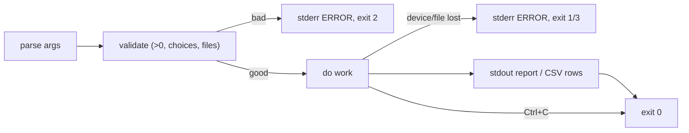
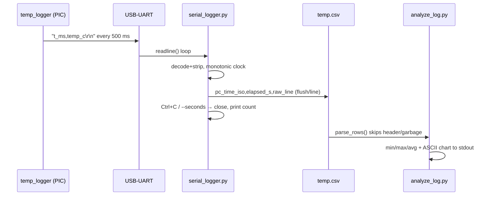

# Application Flow

> Parent: [ARCHITECTURE](../ARCHITECTURE.md). How control moves through firmware
> and tools at runtime.

## 1. Firmware: the universal shape

- `02-basics/`: pure polling (`button_pressed()` blocks on `__delay_ms`).
- `03-intermediate/` + capstone: ISRs stay short (count/flag); `main()` owns
  policy (debounce, 500 ms cadence). EXCEPTION that proves the rule:
  `temp_logger` reads 16-bit `ms_ticks` under a GIE guard ([component](../components/temp-logger-16f877a.md)).
- `watchdog_sleep`: `SLEEP()` → WDT wake → continue after `SLEEP`.

## 2. Tools: the universal shape

## 3. End-to-end capture sequence

Failure branches: port missing → exit 3 before anything; disconnect mid-run →
exit 3 with partial (valid) CSV; empty/garbage CSV → analyzer exit 1.
