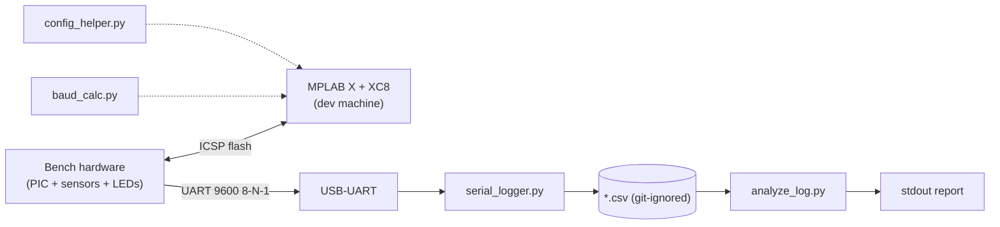

# System Overview

> Parent: [ARCHITECTURE](../ARCHITECTURE.md). Siblings: [application-flow](application-flow.md) ·
> [data-flow](data-flow.md) · [state](state-management.md) · [errors](error-handling.md) ·
> [decisions](decisions.md).

## 1. System in one picture

## 2. Boundaries (what's inside / outside)

| Inside this topic | Outside (trusted as-is) |
|---|---|
| 13 `.c` examples, 4 tools, tests, docs | MPLAB X, XC8, PICkit, Python itself, pyserial (PyPI), OS serial drivers |
| CSV captures (local, ignored) | Terminal emulators, editors |
| Wiring knowledge (`01-docs/`) | Bench power supply, multimeter/scope |

No network boundary, no multi-user boundary, no privilege boundary: single
developer on a bench. [SECURITY](../SECURITY.md) states the resulting posture.

## 3. Deployment mapping

| Artifact | Deployed to | How | Rollback |
|---|---|---|---|
| `*.c` → `.hex` | PIC flash (one chip at a time) | PICkit ICSP, F6 | Reflash previous `.hex` |
| `*.py` tools | Any PC with Python 3.10+ | Copy file, run | Re-copy (git is source of truth) |
| `docs/` | Read in repo (no site build) | git | git |

## 4. Scale & limits

One UART stream (≤ ~11 KB/s), one CSV per run, tools handle ≥100k lines in
seconds ([PERFORMANCE](../PERFORMANCE.md)). Not designed for: multi-device
fleets, wireless links, high-rate DAQ, safety-critical control.

## 5. Traceability

Requirements → this file + [ARCHITECTURE](../ARCHITECTURE.md); behavior →
[modules](../modules/python-tools.md); per-file truth → [components](../components/temp-logger-16f877a.md).
