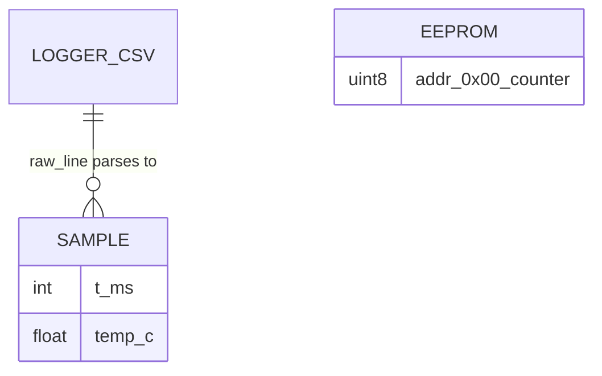

# Storage Schema (adapted: no RDBMS — EEPROM + CSV)

> There is no database server. Persistent state = 1 EEPROM byte + local CSV
> files. This file is the normative schema for both.

## 1. On-chip data EEPROM (PIC16F877A, 256 bytes — 1 used)

| Address | Name | Type | Written by | Read by | Lifetime |
|---|---|---|---|---|---|
| `0x00` | press counter | `uint8` (wraps 255→0) | `eeprom_demo` on debounced press (~4 ms/write) | same, at boot | Until ~1 M writes or bulk erase |

Write ritual: WR-spin → `WREN=1` → GIE off → `0x55`/`0xAA` → `WR=1` → GIE on →
`WREN=0` → WR-spin. Component: [eeprom-demo](../components/eeprom-demo-16f877a.md).
No migrations (single byte), no backup (re-press to rebuild), no indexes.

## 2. Logger CSV (written by `serial_logger.py`)

```csv
pc_time_iso,elapsed_s,raw_line
2026-09-11T00:00:01+00:00,0.500,"500,27.3"
```

| Column | Type | Source | Notes |
|---|---|---|---|
| `pc_time_iso` | UTC ISO-8601 string | `datetime.now(timezone.utc)` | Wall clock (NTP-dependent) |
| `elapsed_s` | float seconds, 3 dp | `time.monotonic()` | Run-relative, drift-free |
| `raw_line` | verbatim device line | UART `readline()` | `csv`-quoted; may contain `,` |

Header always first; flushed per line; files are git-ignored (`*.csv` except
`sample*.csv`). Growth ≈ 60 B/line → rotate by `--out` name ([OPERATIONS](../OPERATIONS.md)).

## 3. Plain `ms,temp` CSV (accepted by analyzer, e.g. terminal strips)

```
ms,temp
500,27.3
```

Two columns: integer ms, float °C. Optional header (skipped as garbage either way).


