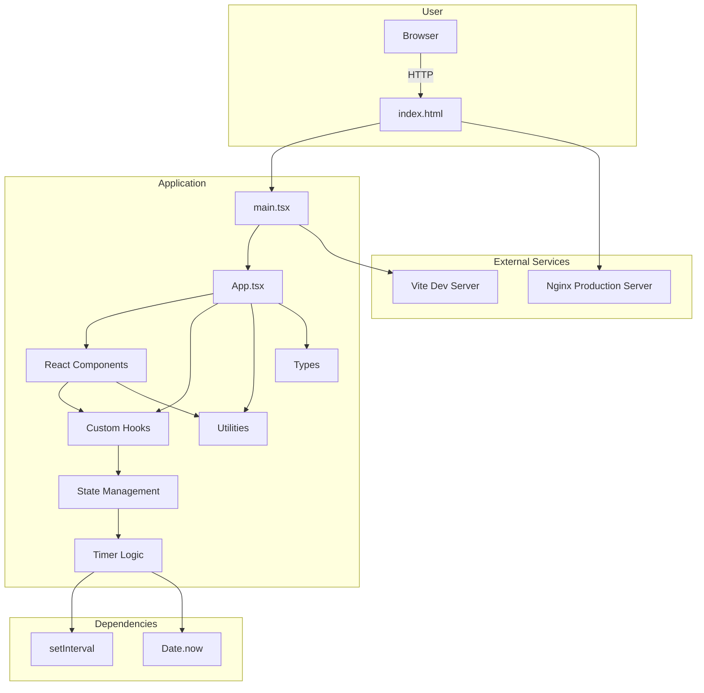
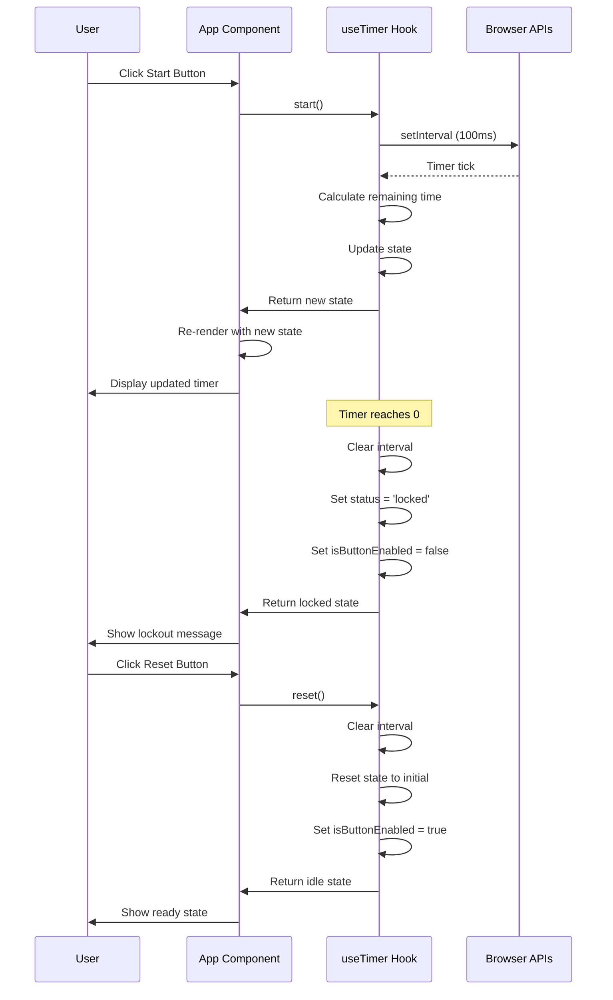
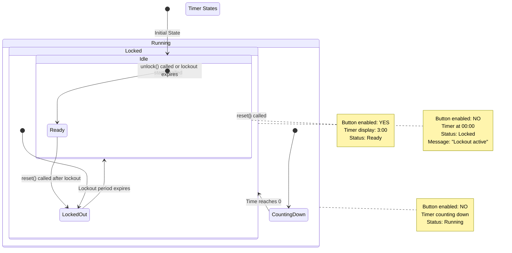
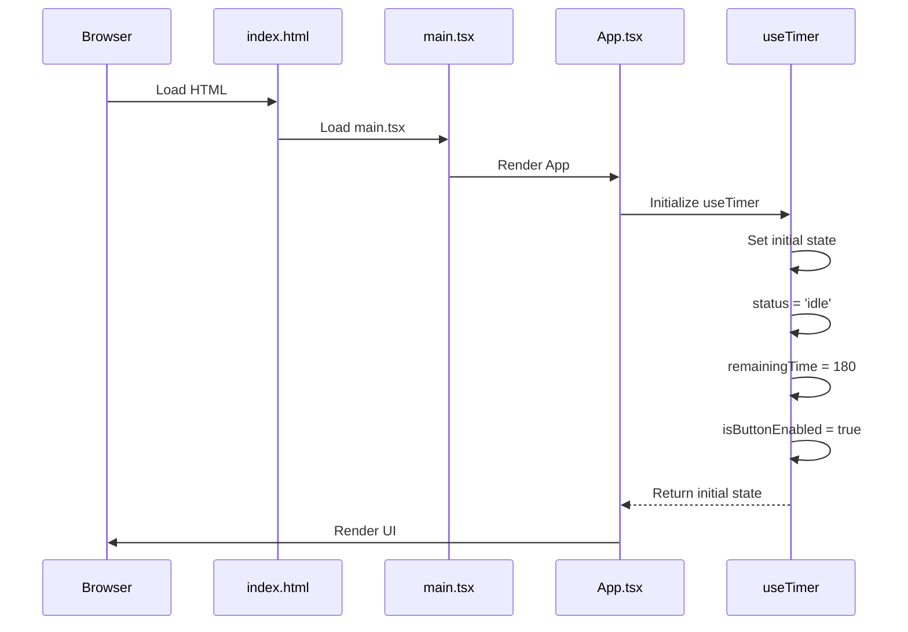
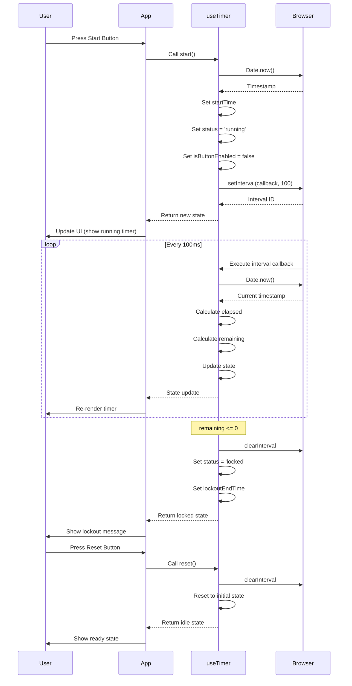
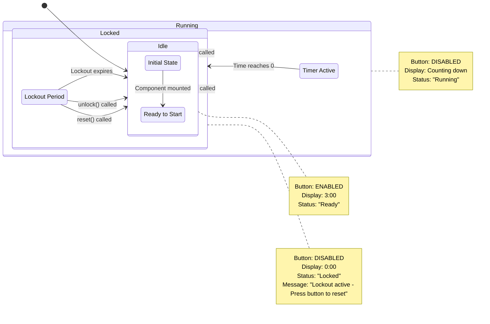
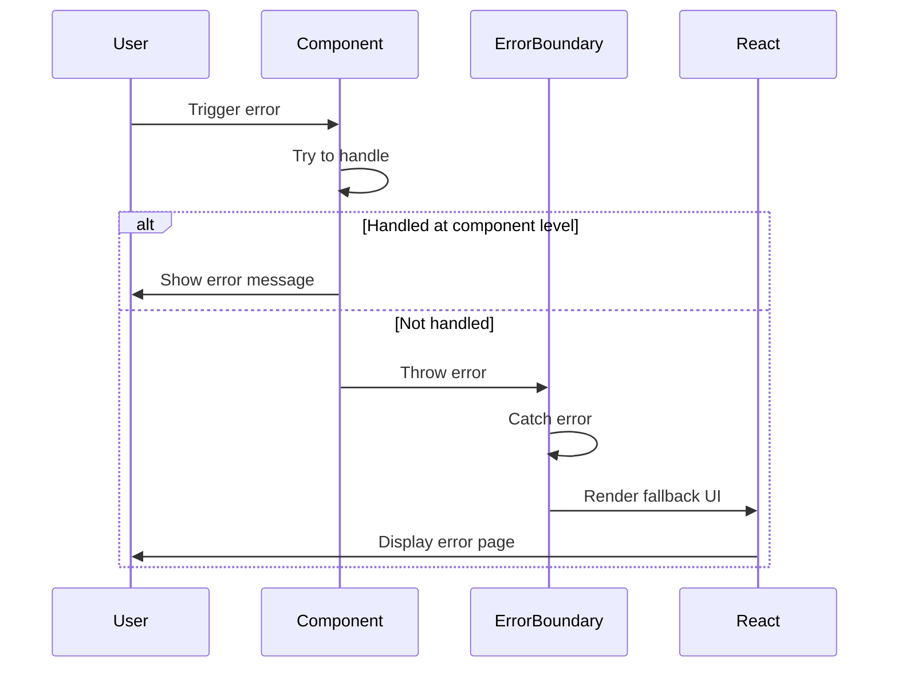

# Architecture Documentation

This document provides a comprehensive overview of the Timer Lockout Application architecture, including system design, data flow, state management, and key architectural decisions.

---

## 🏗️ System Architecture Overview

The Timer Lockout Application follows a **clean, modular, component-based architecture** with clear separation of concerns. The architecture is designed to be:

- **Maintainable**: Clear structure, well-named components, comprehensive documentation
- **Testable**: Isolated components, pure functions, comprehensive test coverage
- **Scalable**: Modular design, reusable components, clean interfaces
- **Reliable**: Error handling, graceful degradation, type safety
- **Accessible**: Keyboard navigation, screen reader support, semantic HTML
- **Performant**: Efficient rendering, minimal dependencies, optimized builds

### High-Level Architecture Diagram



### Architecture Layers

```
┌─────────────────────────────────────────────────────────────┐
│                        PRESENTATION LAYER                        │
│  ┌─────────────┐  ┌─────────────┐  ┌─────────────┐            │
│  │   App.tsx   │  │  Card.tsx   │  │ Button.tsx  │            │
│  └─────────────┘  └─────────────┘  └─────────────┘            │
│  ┌─────────────────────────────────────────────────────────┐│
│  │                    TimerDisplay.tsx                        ││
│  │                    ProgressRing.tsx                         ││
│  │                    StatusIndicator.tsx                      ││
│  └─────────────────────────────────────────────────────────┘│
└─────────────────────────────────────────────────────────────┘
                             │
                             ▼
┌─────────────────────────────────────────────────────────────┐
│                      LOGIC/STATE LAYER                           │
│  ┌─────────────────────────────────────────────────────────┐│
│  │                         useTimer Hook                          ││
│  │  ┌─────────────┐  ┌─────────────┐  ┌─────────────┐      ││
│  │  │   State     │  │  Actions    │  │  Subscribers │      ││
│  │  │ Management  │  │  (start/pause│  │  (event emit) │      ││
│  │  └─────────────┘  │   reset)     │  └─────────────┘      ││
│  │                  └─────────────┘                            ││
│  └─────────────────────────────────────────────────────────┘│
└─────────────────────────────────────────────────────────────┘
                             │
                             ▼
┌─────────────────────────────────────────────────────────────┐
│                      UTILITY LAYER                               │
│  ┌─────────────────────────────────────────────────────────┐│
│  │                    formatTime utilities                       ││
│  │                    Validation helpers                         ││
│  └─────────────────────────────────────────────────────────┘│
└─────────────────────────────────────────────────────────────┘
                             │
                             ▼
┌─────────────────────────────────────────────────────────────┐
│                      TYPE LAYER                                  │
│  ┌─────────────────────────────────────────────────────────┐│
│  │                    TypeScript Definitions                     ││
│  │                    Interfaces & Types                        ││
│  └─────────────────────────────────────────────────────────┘│
└─────────────────────────────────────────────────────────────┘
```

---

## 🎯 Major Subsystems

### 1. Presentation Layer (UI Components)

**Responsibility**: Render the user interface and handle user interactions.

**Components**:
- `App.tsx` - Main application component
- `Button.tsx` - Reusable button component
- `Card.tsx` - Card container component
- `ErrorBoundary.tsx` - Error catching component
- `Instructions.tsx` - Instructions display
- `LoadingSpinner.tsx` - Loading indicator
- `ProgressRing.tsx` - Circular progress visualization
- `Skeleton.tsx` - Content placeholder
- `StatusIndicator.tsx` - Timer status display
- `TimerDisplay.tsx` - Time display component

**Communication**:
- Components receive props from parent
- Components emit events via callbacks
- Components use hooks for stateful logic
- Components use utilities for pure functions

**External Dependencies**:
- React (UI library)
- Tailwind CSS (styling)

---

### 2. Logic/State Layer (Custom Hooks)

**Responsibility**: Manage application state and business logic.

**Hooks**:
- `useTimer.ts` - Core timer logic with lockout functionality

**Communication**:
- Hooks are consumed by components
- Hooks manage internal state
- Hooks expose actions to components
- Hooks emit events to subscribers

**External Dependencies**:
- React (hooks API)
- Browser APIs (setInterval, Date)

---

### 3. Utility Layer

**Responsibility**: Provide reusable, pure functions for common operations.

**Functions**:
- `formatTime.ts` - Time formatting utilities

**Communication**:
- Utilities are imported and used by components and hooks
- Utilities are pure functions (no side effects)

**External Dependencies**: None

---

### 4. Type Layer

**Responsibility**: Provide TypeScript type definitions for type safety.

**Definitions**:
- TimerStatus (enum-like union type)
- TimerState (interface)
- AppConfig (interface)
- ApiResponse (generic interface)
- TimerEvent (union type)
- Component props interfaces

**Communication**:
- Types are imported and used throughout the application
- Types provide compile-time validation

**External Dependencies**: None

---

## 📊 Data Flow Architecture

### Main Timer Workflow



### State Flow



### Event Flow

```mermaid
graph LR
    A[User Action] --> B{Action Type}
    B -->|Start| C[useTimer.start()]
    B -->|Reset| D[useTimer.reset()]
    B -->|Unlock| E[useTimer.unlock()]
    
    C --> F[Set status: running]
    C --> G[Start interval]
    C --> H[Emit START event]
    
    D --> I[Clear interval]
    D --> J[Set status: idle]
    D --> K[Set remainingTime: 180]
    D --> L[Emit RESET event]
    
    E --> M[Clear interval]
    E --> N[Set status: idle]
    E --> O[Set isButtonEnabled: true]
    E --> P[Emit LOCKOUT_END event]
    
    G --> Q[100ms interval]
    Q --> R{Time remaining?}
    R -->|> 0| S[Continue counting]
    R -->|= 0| T[Transition to locked]
    T --> U[Clear interval]
    U --> V[Set lockoutEndTime]
    V --> W[Emit COMPLETE event]
    W --> X[Emit LOCKOUT_START event]
    
    style A fill:#f9f,stroke:#333
    style H fill:#bbf,stroke:#333
    style L fill:#bbf,stroke:#333
    style P fill:#bbf,stroke:#333
    style W fill:#bbf,stroke:#333
```

---

## 🔄 Application Flow

### Initialization Sequence



### User Interaction Flow



---

## 🧠 State Management

### State Structure

The application uses a **centralized state management** approach through the `useTimer` custom hook. The state is structured as follows:

```typescript
interface TimerState {
  status: TimerStatus;           // 'idle' | 'running' | 'locked' | 'completed'
  remainingTime: number;         // Time remaining in seconds
  startTime: number | null;      // Timestamp when timer started
  lockoutEndTime: number | null; // Timestamp when lockout ends
  isButtonEnabled: boolean;      // Whether action button is enabled
}
```

### State Transitions

| Current State | Action | Next State | Button Enabled | Description |
|---------------|--------|------------|---------------|-------------|
| idle | start() | running | NO | Timer starts counting down |
| running | reset() | idle | YES | Timer is reset to initial state |
| running | (time expires) | locked | NO | Timer completes, lockout begins |
| locked | (lockout expires) | idle | YES | Lockout period ends automatically |
| locked | unlock() | idle | YES | Manual unlock via button |
| locked | reset() | idle | YES | Reset button clears lockout |
| idle | start() | running | NO | Timer restarts |

### State Diagram



---

## ⚠️ Error Handling

### Error Handling Strategy

The application implements a **multi-layer error handling** strategy:

1. **Component Level**: Individual components handle their own errors gracefully
2. **Hook Level**: Custom hooks include error handling for edge cases
3. **Application Level**: ErrorBoundary component catches unhandled errors
4. **Build Level**: TypeScript catches type errors at compile time
5. **Lint Level**: ESLint catches potential issues at development time

### Error Handling Flow



### Error Boundary Coverage

The `ErrorBoundary` component wraps the entire application and provides:

- **User-friendly error message**: Clear explanation of what went wrong
- **Technical details**: Expandable section with error stack trace (development only)
- **Recovery option**: Button to refresh the page
- **Accessibility**: Proper ARIA attributes for screen readers

### Error Prevention

| Technique | Implementation | Purpose |
|-----------|----------------|---------|
| TypeScript | Strict mode, noImplicitAny | Catch type errors at compile time |
| ESLint | Comprehensive rules | Catch potential issues early |
| Tests | 90 unit tests | Verify behavior |
| Default Values | Safe fallbacks | Prevent null/undefined errors |
| Input Validation | Type guards | Validate external inputs |
| Error Boundaries | Component wrapper | Catch unhandled errors |

---

## 🔌 Integration Points

### Internal Integrations

| Component/Module | Integrates With | Integration Type |
|-----------------|----------------|------------------|
| App.tsx | useTimer | Hook consumption |
| App.tsx | Button, Card, etc. | Component composition |
| useTimer | setInterval | Browser API |
| useTimer | Date | Browser API |
| TimerDisplay | formatTime | Utility function |
| Button | LoadingSpinner | Component composition |
| All Components | globals.css | Style import |

### External Integrations

| Integration | Type | Purpose |
|-------------|------|---------|
| React | Library | UI component library |
| TypeScript | Language | Type safety |
| Vite | Build Tool | Development and build |
| Tailwind CSS | Framework | Styling |
| Vitest | Framework | Testing |
| ESLint | Tool | Linting |
| Prettier | Tool | Formatting |

---

## 🎨 Design Decisions

### Why React?

**Context**: Need a modern, component-based UI framework for building interactive web applications.

**Options Considered**:
- React - Component-based, large ecosystem, excellent TypeScript support
- Vue - Similar benefits, but slightly different paradigm
- Angular - Full framework, but heavier
- Svelte - Compiles to vanilla JS, but smaller ecosystem
- Vanilla JS - No framework, but more boilerplate

**Decision**: React

**Reason**: 
- Excellent TypeScript integration
- Large, mature ecosystem
- Component-based architecture matches our needs
- Strong community support
- Proven in production at scale

**Consequences**:
- Requires React knowledge for development
- Adds ~45KB to bundle (gzipped)
- Provides excellent developer experience

**Revisit When**: If bundle size becomes critical or if a significantly better alternative emerges

---

### Why TypeScript?

**Context**: Need type safety to prevent runtime errors and improve developer experience.

**Options Considered**:
- TypeScript - Full type system, excellent tooling
- JavaScript with JSDoc - Type hints, but no enforcement
- Flow - Type checking, but less popular

**Decision**: TypeScript

**Reason**:
- Catches errors at compile time
- Excellent IDE support
- Improves code maintainability
- Industry standard for production applications
- Gradual adoption possible

**Consequences**:
- Requires TypeScript knowledge
- Slightly slower build times
- Better code quality and maintainability

**Revisit When**: Never - TypeScript is a core part of the architecture

---

### Why Vite?

**Context**: Need a fast, modern build tool for development and production.

**Options Considered**:
- Vite - Fast, modern, ES modules native
- Create React App - Established, but slower
- Next.js - Full framework, but overkill for SPA
- Webpack - Configurable, but complex
- Parcel - Zero config, but less control

**Decision**: Vite

**Reason**:
- Near-instantaneous hot module replacement
- Uses esbuild for fast builds
- Native ES modules support
- Simple configuration
- Excellent React support

**Consequences**:
- Requires Vite knowledge for custom configuration
- Less configurable than Webpack for complex needs
- Excellent developer experience

**Revisit When**: If build requirements become more complex than Vite can handle

---

### Why Tailwind CSS?

**Context**: Need a CSS solution that provides consistency and rapid development.

**Options Considered**:
- Tailwind CSS - Utility-first, highly customizable
- styled-components - CSS-in-JS, component-scoped
- Emotion - Similar to styled-components
- Sass/Less - Preprocessors, more traditional
- Plain CSS - No framework, but harder to maintain

**Decision**: Tailwind CSS

**Reason**:
- Rapid development with utility classes
- Enforces consistent design language
- No runtime overhead (purges unused classes)
- Excellent customization options
- Growing popularity

**Consequences**:
- Learning curve for utility-first approach
- Can lead to verbose class strings
- Excellent for consistency and maintainability

**Revisit When**: If design requirements become too complex for utility-first approach

---

### Why Custom Hook for Timer Logic?

**Context**: Need to manage timer state and logic in a reusable way.

**Options Considered**:
- Custom hook - Reusable, testable, clean separation
- Context API - Global state, but overkill for single feature
- Redux - Global state management, but too heavy
- Local state - Simple, but not reusable
- Class component - Legacy approach, not recommended

**Decision**: Custom hook (useTimer)

**Reason**:
- Encapsulates timer logic in reusable function
- Clean separation from UI components
- Easy to test in isolation
- Follows React best practices
- Can be used by multiple components

**Consequences**:
- Requires understanding of React hooks
- State management is centralized in hook
- Excellent for this use case

**Revisit When**: If timer logic needs to be shared across many unrelated components

---

### Why Error Boundary?

**Context**: Need to handle errors gracefully without crashing the entire application.

**Options Considered**:
- Error Boundary component - React's built-in solution
- try/catch in components - Doesn't catch rendering errors
- Global error handler - Doesn't catch component errors
- Ignore errors - Poor user experience

**Decision**: Error Boundary component

**Reason**:
- React's recommended approach for error handling
- Catches errors in component tree
- Provides fallback UI
- Doesn't break entire application

**Consequences**:
- Requires wrapping component tree
- Only catches errors in child components
- Excellent for production reliability

**Revisit When**: Never - Error boundaries are a core React feature

---

## 📋 Architectural Constraints

### Technical Constraints

| Constraint | Impact | Mitigation |
|------------|--------|------------|
| Browser API Dependencies | setInterval, Date | Use standard browser APIs |
| No Backend | Client-side only | Store state in memory |
| Single Page Application | No server-side rendering | Use React Router if needed |
| Static Hosting | No server logic | All logic in client |

### Performance Constraints

| Constraint | Impact | Mitigation |
|------------|--------|------------|
| setInterval Accuracy | ~4ms drift | Acceptable for timer precision |
| JavaScript Execution | Variable | Use efficient algorithms |
| Memory Usage | Limited | Clean up intervals, avoid leaks |

### Browser Support Constraints

| Browser | Support | Notes |
|---------|---------|-------|
| Chrome | ✅ Full | Latest 2 versions |
| Firefox | ✅ Full | Latest 2 versions |
| Safari | ✅ Full | Latest 2 versions |
| Edge | ✅ Full | Latest 2 versions |
| IE | ❌ Not Supported | Legacy browser |

---

## 🔄 Migration Path

### Adding New Features

1. **Create new component** in `/src/components/`
2. **Create new hook** in `/src/hooks/` if stateful logic needed
3. **Create new utility** in `/src/utils/` if pure function needed
4. **Add types** in `/src/types/` if new type definitions needed
5. **Write tests** in `/tests/` for new functionality
6. **Update documentation** in `/docs/`
7. **Verify all checks pass** (lint, type-check, tests)

### Modifying Existing Features

1. **Understand current implementation** by reading code and docs
2. **Update tests first** to reflect new behavior
3. **Modify implementation**
4. **Verify tests pass**
5. **Update documentation** if interface changes

### Removing Features

1. **Ensure no dependencies** on the feature
2. **Remove tests** for the feature
3. **Remove implementation**
4. **Remove documentation**
5. **Verify application still works**

---

## 📚 Related Documentation

- [PROJECT_STRUCTURE.md](./PROJECT_STRUCTURE.md) - Repository structure
- [SETUP.md](./SETUP.md) - Setup instructions
- [DEVELOPMENT.md](./DEVELOPMENT.md) - Development workflow
- [docs/architecture/system-overview.md](./architecture/system-overview.md) - System overview
- [docs/architecture/data-flow.md](./architecture/data-flow.md) - Data flow details
- [docs/architecture/state-management.md](./architecture/state-management.md) - State management details
- [docs/architecture/error-handling.md](./architecture/error-handling.md) - Error handling details
