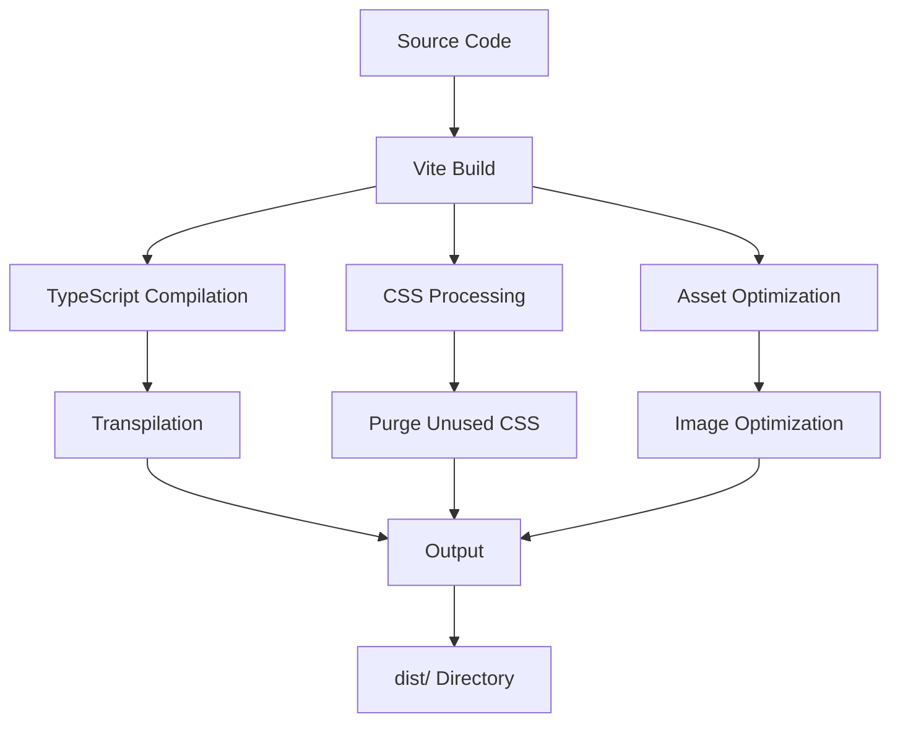

# Build Documentation

This document provides comprehensive information about building the Timer Lockout Application for production.

---

## 🏭 Build Overview

The Timer Lockout Application uses **Vite** as its build system, providing fast, modern, and efficient builds for production deployment.

### Build Process



### Build Features

| Feature | Description | Benefit |
|---------|-------------|---------|
| **ES Modules** | Native ES module output | Better performance, smaller bundles |
| **Code Splitting** | Automatic code splitting | Faster initial load |
| **Tree Shaking** | Remove unused code | Smaller bundle size |
| **Minification** | Minify output code | Faster downloads |
| **Source Maps** | Generate source maps | Better debugging |
| **Asset Hashing** | Content-hashed filenames | Better caching |
| **CSS Optimization** | Purge unused CSS | Smaller CSS bundles |

---

## 📦 Build Prerequisites

### Required Software

| Software | Version | Purpose |
|---------|---------|---------|
| **Node.js** | 18+ | JavaScript runtime |
| **npm** | 9+ | Package manager |

### Required Files

The following files must be present for a successful build:

| File | Purpose |
|------|---------|
| `package.json` | Project manifest |
| `vite.config.ts` | Build configuration |
| `tsconfig.json` | TypeScript configuration |
| `tailwind.config.js` | Tailwind CSS configuration |
| `postcss.config.js` | PostCSS configuration |
| `index.html` | Entry point |
| All source files in `src/` | Application code |

---

## 🔨 Build Commands

### Production Build

```bash
# Build for production
npm run build
```

This command:
1. Runs TypeScript compilation
2. Runs Vite build
3. Generates optimized production assets
4. Outputs to `dist/` directory

**Output**: Production-ready files in `dist/`

### Full Production Build

```bash
# Build with all checks
npm run build:prod
```

This command:
1. Runs TypeScript type checking
2. Runs ESLint
3. Runs production build

**Use**: For final release builds to ensure all checks pass

### Preview Production Build

```bash
# Preview the production build locally
npm run preview
```

This command:
1. Serves the `dist/` directory
2. Runs a local HTTP server
3. Allows testing the production build before deployment

**Note**: This is for local testing only, not for production deployment.

---

## 📂 Build Output

### Directory Structure

After a successful build, the `dist/` directory will contain:

```
dist/
├── index.html                 # Entry HTML file
├── favicon.svg               # Application icon
└── assets/
    ├── index-<hash>.css      # Minified stylesheet
    ├── index-<hash>.js       # Main application bundle
    └── vendor-<hash>.js      # Vendor dependencies bundle
```

### File Descriptions

| File | Description | Size (approx.) |
|------|-------------|---------------|
| `index.html` | HTML entry point with injected scripts | ~1 KB |
| `favicon.svg` | Application favicon | ~0.5 KB |
| `index-<hash>.css` | Minified CSS with all styles | ~20 KB |
| `index-<hash>.js` | Minified application code | ~18 KB |
| `vendor-<hash>.js` | Minified vendor dependencies | ~140 KB |

**Total Size**: ~180 KB (uncompressed), ~50 KB (gzipped)

### Filename Hashing

Files in the `assets/` directory have content-based hashes in their filenames:
- `index-Cva3b5QV.css` (example)
- `index-BnE8s3OT.js` (example)
- `vendor-nf7bT_Uh.js` (example)

**Benefits**:
- Cache busting: New version when content changes
- Long cache times: Can cache aggressively
- Parallel loading: Multiple versions can coexist

---

## ⚙️ Build Configuration

### Vite Configuration (`vite.config.ts`)

The build is configured in `vite.config.ts`:

```typescript
import { defineConfig } from 'vite';
import react from '@vitejs/plugin-react';
import path from 'path';

export default defineConfig({
  plugins: [react()],
  resolve: {
    alias: {
      '@': path.resolve(__dirname, './src'),
    },
  },
  test: {
    globals: true,
    environment: 'jsdom',
    setupFiles: './tests/setup.ts',
    css: true,
  },
  server: {
    port: 5173,
    open: true,
  },
  build: {
    outDir: 'dist',
    sourcemap: true,
    rollupOptions: {
      output: {
        manualChunks: {
          vendor: ['react', 'react-dom'],
        },
      },
    },
  },
});
```

### Configurable Build Options

| Option | Type | Default | Description |
|--------|------|---------|-------------|
| `build.outDir` | string | `'dist'` | Output directory |
| `build.sourcemap` | boolean | `true` | Generate source maps |
| `build.minify` | boolean | `true` | Minify output |
| `build.terserOptions` | Object | `{}` | Terser minification options |
| `build.rollupOptions` | Object | `{}` | Rollup configuration |
| `build.emptyOutDir` | boolean | `true` | Empty output directory before build |
| `build.target` | string | `'es2020'` | Browser target |

### Customizing Build

#### Change Output Directory

```typescript
build: {
  outDir: 'build', // Change from 'dist' to 'build'
  // ...
}
```

#### Disable Source Maps

```typescript
build: {
  sourcemap: false, // Disable source maps
  // ...
}
```

#### Custom Chunk Splitting

```typescript
build: {
  rollupOptions: {
    output: {
      manualChunks: {
        vendor: ['react', 'react-dom'],
        utils: ['lodash'], // Example: Separate utils chunk
      },
    },
  },
}
```

#### Change Browser Target

```typescript
build: {
  target: 'es2015', // Support older browsers
  // ...
}
```

---

## 🎯 Build Optimization

### Automatic Optimizations

Vite automatically applies these optimizations:

| Optimization | Description | Impact |
|--------------|-------------|--------|
| **ESM Output** | Native ES modules | Better performance |
| **Code Splitting** | Split code into chunks | Faster initial load |
| **Tree Shaking** | Remove unused code | Smaller bundles |
| **Minification** | Minify with esbuild | Smaller files |
| **CSS Code Splitting** | Split CSS by chunk | Better caching |
| **Asset Inlining** | Inline small assets | Fewer requests |
| **Preloading** | Preload important assets | Faster loading |

### Manual Optimizations

#### Reduce Bundle Size

1. **Remove unused dependencies**:
   ```bash
   npm uninstall unused-package
   ```

2. **Use dynamic imports**:
   ```typescript
   // Instead of:
   import HeavyComponent from './HeavyComponent';
   
   // Use:
   const HeavyComponent = React.lazy(() => import('./HeavyComponent'));
   ```

3. **Optimize assets**:
   - Use compressed images
   - Use modern formats (WebP, AVIF)
   - Use appropriate image sizes

#### Improve Performance

1. **Code splitting**:
   ```typescript
   // Split vendor and application code
   rollupOptions: {
     output: {
       manualChunks: {
         vendor: ['react', 'react-dom'],
       },
     },
   }
   ```

2. **Preload important assets**:
   ```html
   <!-- In index.html -->
   <link rel="modulepreload" href="/src/main.tsx">
   ```

3. **Use production mode**:
   ```bash
   # Build with production mode
   NODE_ENV=production npm run build
   ```

---

## 🧪 Build Validation

### Validate Build Output

After building, validate the output:

```bash
# 1. Check that dist/ directory exists
ls -la dist/

# 2. Check that all expected files exist
ls -la dist/assets/

# 3. Check file sizes
du -sh dist/
du -sh dist/assets/

# 4. Preview the build
npm run preview
```

### Common Build Issues

#### Issue: Build fails with TypeScript errors

**Symptom**: `error TSxxxx: ...`

**Solution**:
```bash
# Run type checking to see errors
npm run type-check

# Fix the TypeScript errors
# Then rebuild
npm run build
```

#### Issue: Build fails with missing dependencies

**Symptom**: `Cannot find module 'xxx'`

**Solution**:
```bash
# Install missing dependencies
npm install

# Or install specific package
npm install package-name

# Then rebuild
npm run build
```

#### Issue: Build output is too large

**Symptom**: Large files in `dist/`

**Solution**:
1. Check bundle size:
   ```bash
   du -sh dist/
   ```

2. Analyze bundle:
   ```bash
   npm install --save-dev rollup-plugin-visualizer
   # Then update vite.config.ts to use the plugin
   ```

3. Optimize:
   - Remove unused dependencies
   - Use dynamic imports
   - Optimize assets

#### Issue: CSS not loading in production

**Symptom**: Styles missing in production build

**Solution**:
1. Check that Tailwind is processing files:
   ```bash
   # Check tailwind.config.js content paths
   cat tailwind.config.js
   ```

2. Ensure files are in content paths:
   ```javascript
   content: [
     "./index.html",
     "./src/**/*.{js,ts,jsx,tsx}",
   ]
   ```

3. Rebuild:
   ```bash
   npm run build
   ```

---

## 📊 Build Metrics

### Size Metrics

| Metric | Value | Notes |
|--------|-------|-------|
| **Total Uncompressed** | ~180 KB | All files |
| **Total Compressed** | ~50 KB | Gzipped |
| **HTML** | ~1 KB | index.html |
| **CSS** | ~20 KB | Stylesheet |
| **JS (App)** | ~18 KB | Application code |
| **JS (Vendor)** | ~140 KB | Dependencies |
| **Assets** | ~0.5 KB | favicon.svg |

### Performance Metrics

| Metric | Value | Notes |
|--------|-------|-------|
| **Build Time** | ~1-3 seconds | On modern hardware |
| **First Load JS** | ~160 KB | With vendor chunk |
| **First Load CSS** | ~20 KB | Stylesheet |
| **Time to Interactive** | < 1 second | With caching |

---

## 🚀 Deployment Build

For production deployment, use the full build process:

```bash
# 1. Run all checks
npm run check

# 2. Build for production
npm run build

# 3. Verify build
ls -la dist/

# 4. Deploy dist/ directory
# (See DEPLOYMENT.md for deployment instructions)
```

---

## 🔄 Continuous Integration Build

For CI/CD pipelines, use:

```bash
# Full validation and build
npm run check:ci
```

This runs:
1. Type checking
2. Linting (all files)
3. Tests with coverage

---

## 📚 Related Documentation

- [SETUP.md](./SETUP.md) - Setup instructions
- [DEVELOPMENT.md](./DEVELOPMENT.md) - Development workflow
- [CONFIGURATION.md](./CONFIGURATION.md) - Configuration options
- [DEPLOYMENT.md](./DEPLOYMENT.md) - Deployment guide
- [ARCHITECTURE.md](./ARCHITECTURE.md) - Architecture overview
- [PROJECT_STRUCTURE.md](./PROJECT_STRUCTURE.md) - Project structure
