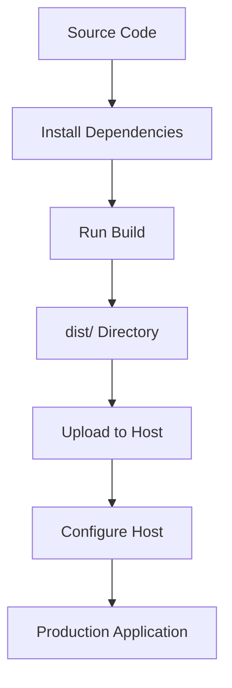

# Deployment Guide

This document provides comprehensive instructions for deploying the Timer Lockout Application to various hosting environments.

---

## 🚀 Deployment Overview

The Timer Lockout Application is a **static web application** that can be deployed to any hosting service that supports static file serving. The build process generates optimized production files in the `dist/` directory.

### Deployment Workflow



### Supported Deployment Methods

| Method | Type | Complexity | Cost | Best For |
|--------|------|------------|------|----------|
| **Static Hosting** | Static Files | ⭐ Easy | Free-$ | Simple deployment |
| **Docker** | Container | ⭐⭐ Medium | Free | Containerized deployment |
| **Node.js Server** | Dynamic | ⭐⭐⭐ Hard | $ | Advanced use cases |

---

## 📦 Build for Deployment

Before deploying, build the production version of the application:

```bash
# 1. Navigate to project directory
cd timer-lockout

# 2. Install dependencies (if not already installed)
npm install

# 3. Run production build
npm run build:prod
```

**Build Output**: All production files in `dist/` directory

**Verify Build**:
```bash
# Check that dist/ directory exists
ls -la dist/

# Check file sizes
du -sh dist/

# Preview build locally
npm run preview
```

---

## 🌐 Static Hosting Deployment

Static hosting is the **recommended deployment method** for the Timer Lockout Application. All major static hosting providers support zero-configuration deployment.

### Common Static Hosting Providers

| Provider | Free Tier | Custom Domain | HTTPS | CI/CD |
|----------|-----------|---------------|------|-------|
| **Vercel** | ✅ Yes | ✅ Yes | ✅ Yes | ✅ Yes |
| **Netlify** | ✅ Yes | ✅ Yes | ✅ Yes | ✅ Yes |
| **GitHub Pages** | ✅ Yes | ✅ Yes | ✅ Yes | ✅ Yes |
| **Cloudflare Pages** | ✅ Yes | ✅ Yes | ✅ Yes | ✅ Yes |
| **AWS S3 + CloudFront** | ⚠️ Limited | ❌ No | ✅ Yes | ⚠️ Manual |
| **Firebase Hosting** | ✅ Yes | ✅ Yes | ✅ Yes | ✅ Yes |

---

### Vercel Deployment

**Recommended**: Vercel provides the best experience for Vite applications with zero configuration.

#### Step 1: Install Vercel CLI

```bash
# Install Vercel CLI globally
npm install -g vercel

# Or use npx
npx vercel
```

#### Step 2: Deploy

```bash
# Deploy from the timer-lockout directory
cd timer-lockout
vercel
```

**First Deployment**:
1. Vercel will prompt for login
2. Select the Vercel account
3. Set the project name
4. Configure build settings (auto-detected)
5. Deploy

**Subsequent Deployments**:
```bash
vercel
```

#### Step 3: Configure Production Deployment

For production deployment:

```bash
vercel --prod
```

#### Vercel Configuration

Vercel automatically detects:
- Framework: Vite
- Build command: `npm run build`
- Output directory: `dist/`
- Install command: `npm install`

**Custom Configuration** (`vercel.json`):

```json
{
  "version": 2,
  "builds": [
    {
      "src": "package.json",
      "use": "@vercel/vite",
      "config": { "viteConfigPath": "vite.config.ts" }
    }
  ],
  "routes": [
    {
      "src": "/(.*)",
      "dest": "index.html"
    }
  ]
}
```

#### Vercel Environment Variables

Set environment variables in Vercel dashboard or via CLI:

```bash
vercel env add VITE_APP_TITLE
vercel env add VITE_LOCKOUT_DURATION
```

---

### Netlify Deployment

Netlify provides excellent support for Vite applications.

#### Step 1: Install Netlify CLI

```bash
npm install -g netlify-cli
```

#### Step 2: Deploy

```bash
# From the timer-lockout directory
cd timer-lockout
netlify deploy
```

**First Deployment**:
1. Netlify will prompt for login
2. Select the Netlify account
3. Configure build settings (auto-detected)
4. Deploy

**Production Deployment**:
```bash
netlify deploy --prod
```

#### Netlify Configuration

Netlify automatically detects:
- Build command: `npm run build`
- Publish directory: `dist/`
- Node version: 18

**Custom Configuration** (`netlify.toml`):

```toml
[build]
  command = "npm run build"
  publish = "dist"
  base = "timer-lockout"

[context.production]
  command = "npm run build:prod"

[[redirects]]
  from = "/*"
  to = "/index.html"
  status = 200
```

---

### GitHub Pages Deployment

GitHub Pages is a free hosting service for GitHub repositories.

#### Step 1: Configure package.json

Add GitHub Pages deployment script:

```json
{
  "scripts": {
    "deploy": "npm run build && gh-pages -d dist",
    "predeploy": "npm run build"
  }
}
```

#### Step 2: Install gh-pages

```bash
npm install --save-dev gh-pages
```

#### Step 3: Configure GitHub Pages

1. Create `gh-pages` branch (or use existing)
2. Configure GitHub repository settings:
   - Go to Settings → Pages
   - Select `gh-pages` branch
   - Select `/` (root) folder
   - Save

#### Step 4: Deploy

```bash
npm run deploy
```

**Note**: GitHub Pages has some limitations:
- No server-side functionality
- Limited to static files
- Custom domains require CNAME file

#### GitHub Pages Configuration

Create `.github/workflows/deploy.yml` for automatic deployment:

```yaml
name: Deploy to GitHub Pages

on:
  push:
    branches: [main]

jobs:
  deploy:
    runs-on: ubuntu-latest
    steps:
      - uses: actions/checkout@v4
      - uses: actions/setup-node@v4
        with:
          node-version: 18
      - run: npm ci
      - run: npm run build
      - uses: peaceiris/actions-gh-pages@v3
        with:
          github_token: ${{ secrets.GITHUB_TOKEN }}
          publish_dir: ./dist
```

---

### Cloudflare Pages Deployment

Cloudflare Pages provides fast, global deployment.

#### Step 1: Connect Repository

1. Go to Cloudflare Dashboard
2. Select Pages
3. Connect GitHub repository
4. Select the repository
5. Configure build settings

#### Step 2: Configure Build

**Build Settings**:
- Build command: `npm run build`
- Build output directory: `dist/`
- Root directory: `timer-lockout/`

#### Step 3: Deploy

Cloudflare will automatically deploy on push to the configured branch.

---

### AWS S3 Deployment

For AWS S3 + CloudFront deployment.

#### Step 1: Create S3 Bucket

```bash
# Using AWS CLI
aws s3 mb s3://your-bucket-name
```

Or via AWS Console:
1. Go to S3 service
2. Create bucket
3. Configure bucket for static website hosting

#### Step 2: Enable Static Website Hosting

```bash
aws s3 website s3://your-bucket-name --index-document index.html --error-document index.html
```

#### Step 3: Set Bucket Policy

```json
{
  "Version": "2012-10-17",
  "Statement": [
    {
      "Sid": "PublicReadGetObject",
      "Effect": "Allow",
      "Principal": "*",
      "Action": "s3:GetObject",
      "Resource": "arn:aws:s3:::your-bucket-name/*"
    }
  ]
}
```

#### Step 4: Upload Files

```bash
# Build the application
npm run build

# Upload to S3
aws s3 sync dist/ s3://your-bucket-name
```

#### Step 5: Configure CloudFront (Optional)

1. Create CloudFront distribution
2. Set origin to S3 bucket
3. Set default root object to `index.html`
4. Configure caching behavior

---

## 🐳 Docker Deployment

Docker provides containerized deployment for consistent environments.

### Step 1: Build Docker Image

```bash
# From the timer-lockout directory
docker build -t timer-lockout .
```

This uses the `Dockerfile` in the project root.

### Step 2: Run Container

```bash
# Run on port 80
docker run -p 80:80 timer-lockout

# Run on custom port
docker run -p 3000:80 timer-lockout

# Run with custom environment variables
docker run -p 80:80 -e VITE_APP_TITLE="Custom" timer-lockout
```

### Step 3: Docker Compose (Optional)

Create `docker-compose.yml`:

```yaml
version: '3.8'

services:
  timer-lockout:
    build: .
    ports:
      - "80:80"
    environment:
      - VITE_APP_TITLE=Timer Lockout
      - VITE_LOCKOUT_DURATION=180
    restart: unless-stopped
```

Run with:
```bash
docker-compose up -d
```

### Docker Configuration

**Dockerfile** (included in project):

```dockerfile
# Multi-stage Docker build

# Stage 1: Build the application
FROM node:18-alpine AS builder
WORKDIR /app
COPY package*.json ./
RUN npm ci
COPY . .
RUN npm run build

# Stage 2: Production image
FROM nginx:alpine
COPY --from=builder /app/dist /usr/share/nginx/html
COPY nginx.conf /etc/nginx/conf.d/default.conf
EXPOSE 80
HEALTHCHECK --interval=30s --timeout=3s --start-period=5s --retries=3 \
  CMD wget --no-verbose --tries=1 --spider http://localhost/ || exit 1
CMD ["nginx", "-g", "daemon off;"]
```

**Nginx Configuration** (included in project):

```nginx
server {
    listen 80;
    server_name localhost;
    root /usr/share/nginx/html;
    index index.html;
    
    gzip on;
    gzip_types text/plain text/css application/json application/javascript;
    
    location / {
        try_files $uri $uri/ /index.html;
    }
    
    location /health {
        access_log off;
        return 200 "OK\n";
    }
}
```

### Docker Hub Deployment

To deploy to Docker Hub:

```bash
# Login to Docker Hub
docker login

# Build and tag
docker build -t yourusername/timer-lockout:latest .

# Push to Docker Hub
docker push yourusername/timer-lockout:latest

# Pull and run on any server
docker run -p 80:80 yourusername/timer-lockout:latest
```

---

## 🌍 Manual Deployment

For manual deployment to any web server.

### Step 1: Build Application

```bash
npm run build
```

### Step 2: Upload Files

Upload all files from `dist/` directory to your web server.

**Required Files**:
```
dist/
├── index.html
├── favicon.svg
└── assets/
    ├── index-*.css
    ├── index-*.js
    └── vendor-*.js
```

### Step 3: Configure Server

Ensure your server:
1. Serves `index.html` for all routes (for SPA routing)
2. Sets correct MIME types for `.js` and `.css` files
3. Enables gzip compression (recommended)
4. Sets caching headers for static assets

**Example Nginx Configuration**:

```nginx
server {
    listen 80;
    server_name yourdomain.com;
    root /path/to/dist;
    index index.html;
    
    location / {
        try_files $uri $uri/ /index.html;
    }
    
    location ~* \.(js|css|png|jpg|jpeg|gif|ico|svg)$ {
        expires 1y;
        add_header Cache-Control "public, immutable";
    }
}
```

**Example Apache Configuration**:

```apache
<VirtualHost *:80>
    ServerName yourdomain.com
    DocumentRoot /path/to/dist
    
    <Directory /path/to/dist>
        Options Indexes FollowSymLinks
        AllowOverride All
        Require all granted
    </Directory>
    
    <FilesMatch "\.(js|css|png|jpg|jpeg|gif|ico|svg)$">
        Header set Cache-Control "public, max-age=31536000, immutable"
    </FilesMatch>
    
    FallbackResource /index.html
</VirtualHost>
```

---

## 🔍 Post-Deployment Verification

After deployment, verify the application is working correctly:

### Basic Verification

1. **Access the application**: Open the deployed URL in a browser
2. **Check loading**: Application should load without errors
3. **Test functionality**:
   - Timer starts correctly
   - Countdown works
   - Lockout period activates
   - Reset button works

### Advanced Verification

1. **Check console**: Open browser dev tools and check for errors
2. **Test responsive design**: Resize browser, test on mobile devices
3. **Test accessibility**: Use screen reader or keyboard navigation
4. **Test performance**: Use Lighthouse or similar tools
5. **Check network**: Verify all assets load correctly

### Lighthouse Audit

Run a Lighthouse audit:

1. Open Chrome DevTools (F12)
2. Go to Lighthouse tab
3. Run audit for:
   - Performance
   - Accessibility
   - Best Practices
   - SEO

**Expected Scores**:
- Performance: 90-100
- Accessibility: 100
- Best Practices: 100
- SEO: 90-100

---

## 🔄 Continuous Deployment

Set up continuous deployment to automatically deploy on code changes.

### GitHub Actions

Example workflow (`.github/workflows/deploy.yml`):

```yaml
name: Deploy to Production

on:
  push:
    branches: [main]

jobs:
  build-and-deploy:
    runs-on: ubuntu-latest
    steps:
      - uses: actions/checkout@v4
      - uses: actions/setup-node@v4
        with:
          node-version: 18
      - run: npm ci
      - run: npm run build:prod
      - uses: actions/upload-artifact@v4
        with:
          name: production-build
          path: dist/
      - uses: vercel/action@v2
        with:
          vercel-token: ${{ secrets.VERCEL_TOKEN }}
          vercel-org-id: ${{ secrets.VERCEL_ORG_ID }}
          vercel-project-id: ${{ secrets.VERCEL_PROJECT_ID }}
          working-directory: .
          scope: vercel
          vercel-args: '--prod'
        env:
          VERCEL_ENV: production
```

---

## 📊 Deployment Checklist

### Before Deployment

- [ ] All code committed and pushed
- [ ] All tests passing
- [ ] All linting passing
- [ ] All type checks passing
- [ ] Build completes successfully
- [ ] Environment variables configured
- [ ] Custom domain configured (if applicable)
- [ ] SSL certificate configured (if applicable)

### After Deployment

- [ ] Application loads in browser
- [ ] No console errors
- [ ] Timer functionality works
- [ ] Responsive design works
- [ ] Accessibility features work
- [ ] Performance is acceptable
- [ ] All links work
- [ ] Favicon displays correctly

---

## 🛠️ Deployment Troubleshooting

### Common Issues and Solutions

#### Issue: Application doesn't load

**Symptoms**: Blank page or 404 errors

**Causes**:
- Wrong deployment directory
- Missing files
- Incorrect server configuration

**Solutions**:
1. Verify all files are uploaded:
   ```bash
   ls -la dist/
   ```

2. Check server configuration for SPA support

3. Verify index.html is the default document

---

#### Issue: Styles not loading

**Symptoms**: Unstyled application

**Causes**:
- CSS file not uploaded
- Wrong MIME type for CSS files
- Incorrect file paths

**Solutions**:
1. Verify CSS files exist in `dist/assets/`

2. Check server MIME types:
   - `.css` files should have `text/css` MIME type

3. Check file paths in index.html

---

#### Issue: JavaScript not loading

**Symptoms**: Application doesn't work, no React

**Causes**:
- JavaScript file not uploaded
- Wrong MIME type for JS files
- Browser blocking scripts

**Solutions**:
1. Verify JS files exist in `dist/assets/`

2. Check server MIME types:
   - `.js` files should have `application/javascript` MIME type

3. Check browser console for errors

---

#### Issue: 404 errors for assets

**Symptoms**: Failed to load CSS/JS files

**Causes**:
- Wrong base URL
- Files not uploaded
- Incorrect file paths

**Solutions**:
1. Check that all files in `dist/assets/` are uploaded

2. Verify base URL configuration:
   ```env
   VITE_BASE_URL=/subdirectory/
   ```

3. Check file paths in index.html

---

#### Issue: Environment variables not working

**Symptoms**: Default values used instead of configured values

**Causes**:
- Variables not set in hosting provider
- Wrong variable names
- Variables not prefixed with `VITE_`

**Solutions**:
1. Verify variable names are prefixed with `VITE_`

2. Check hosting provider environment variable configuration

3. Test locally with `.env` file

---

## 📚 Related Documentation

- [SETUP.md](./SETUP.md) - Setup instructions
- [CONFIGURATION.md](./CONFIGURATION.md) - Configuration options
- [BUILD.md](./BUILD.md) - Build process
- [OPERATIONS.md](./OPERATIONS.md) - Operations guide
- [TROUBLESHOOTING.md](./TROUBLESHOOTING.md) - Troubleshooting guide
- [SECURITY.md](./SECURITY.md) - Security considerations
