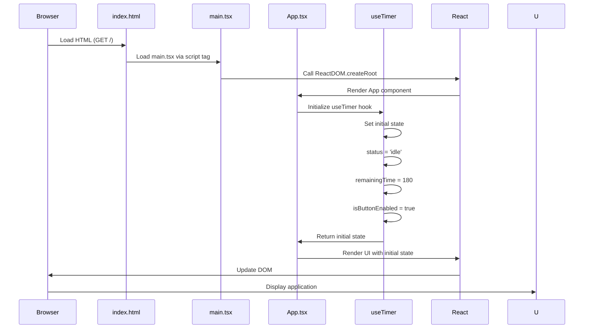
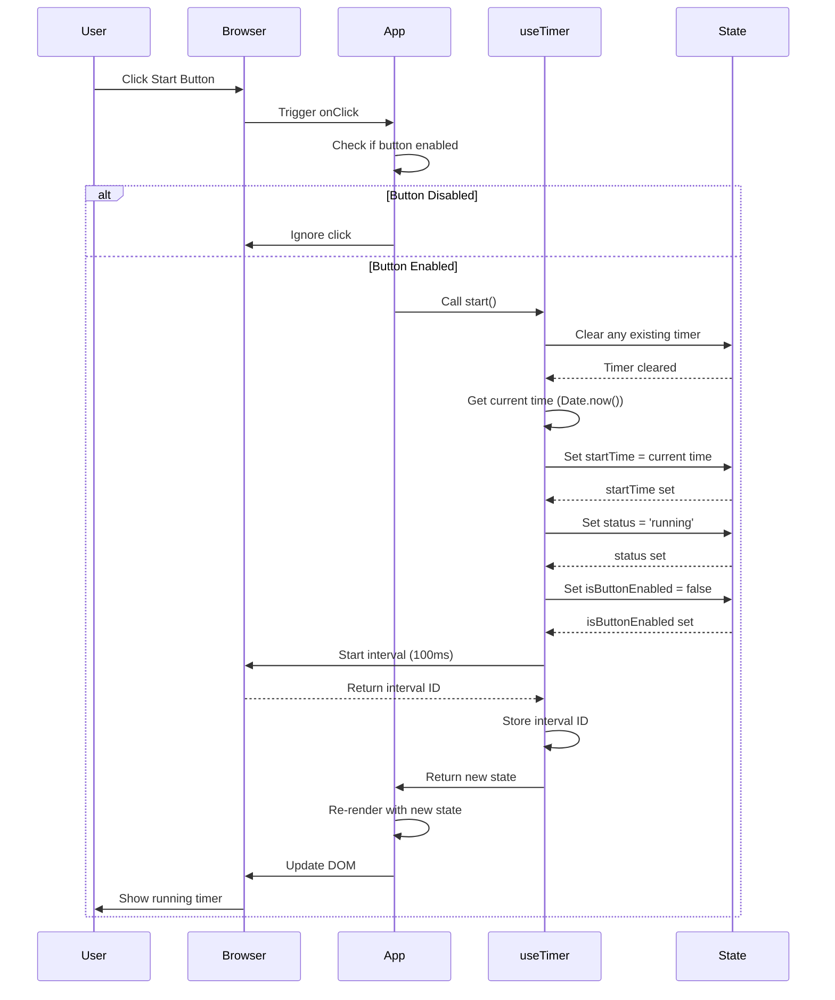
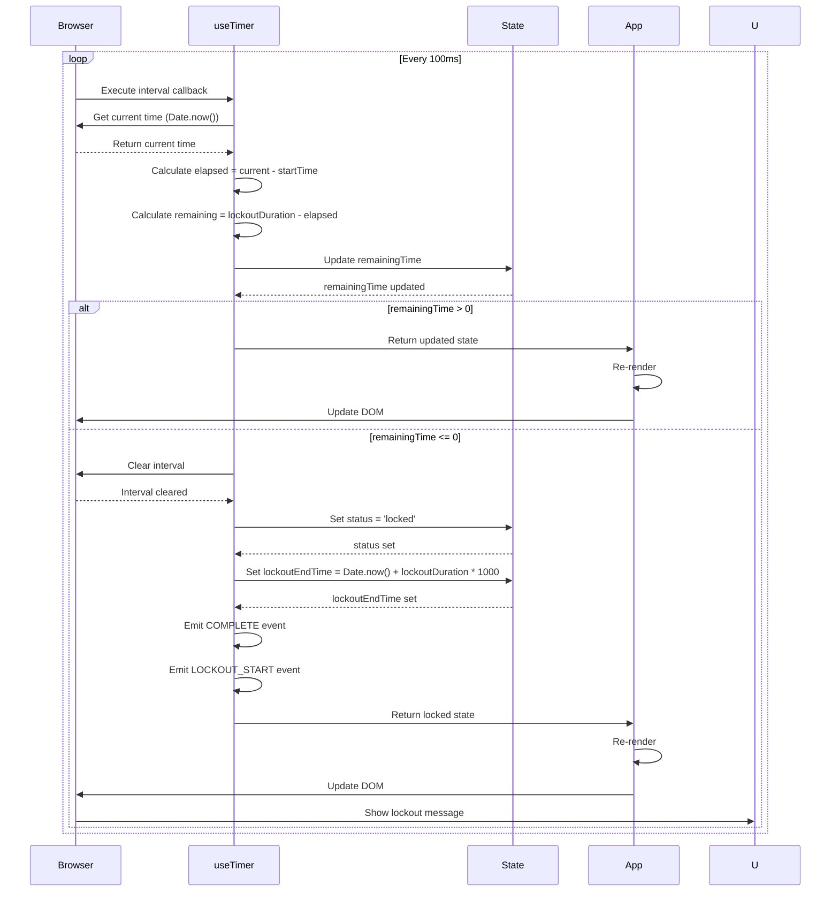
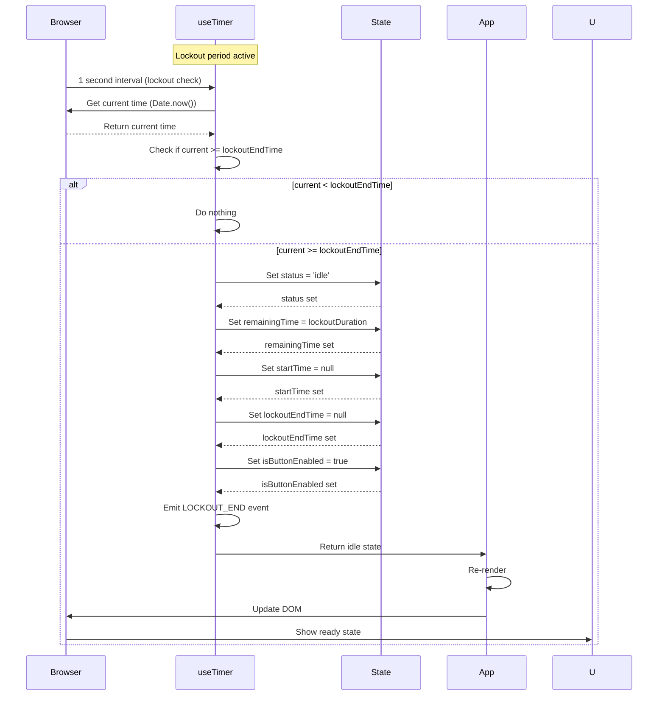
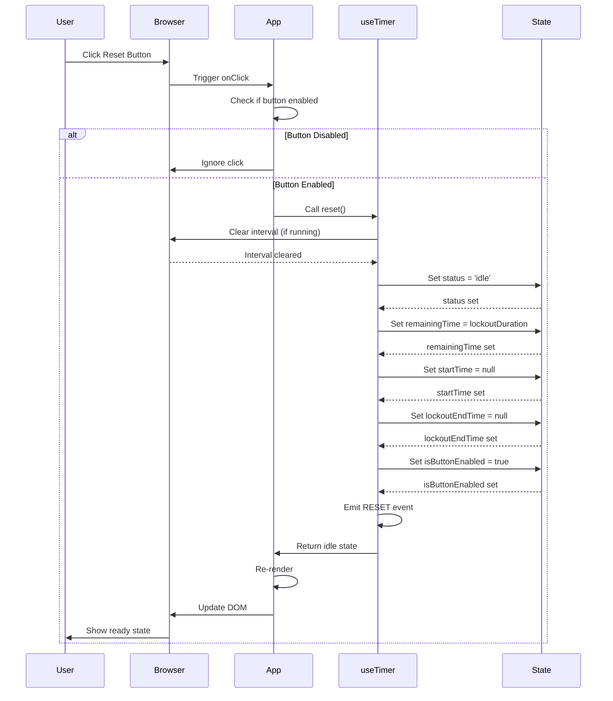
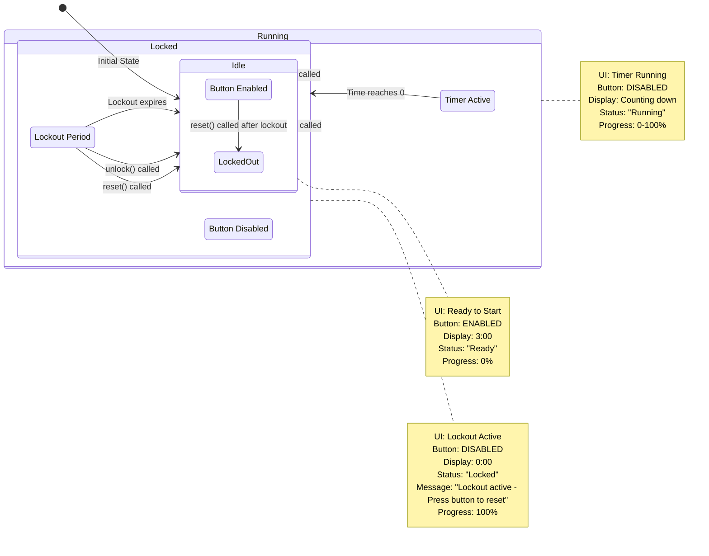
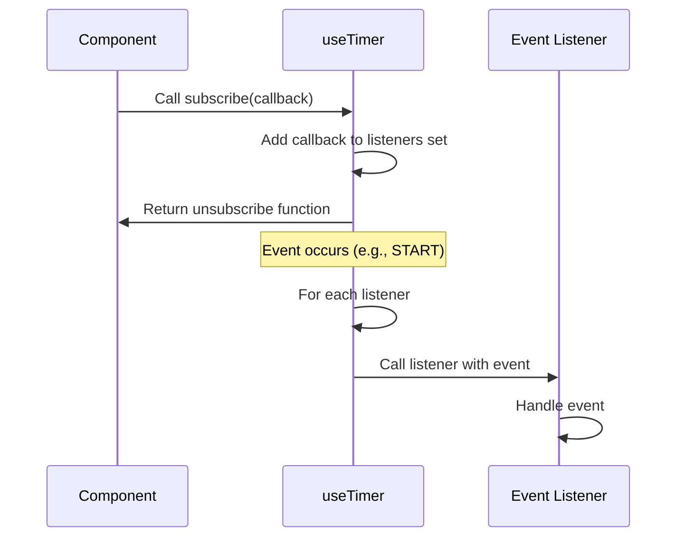
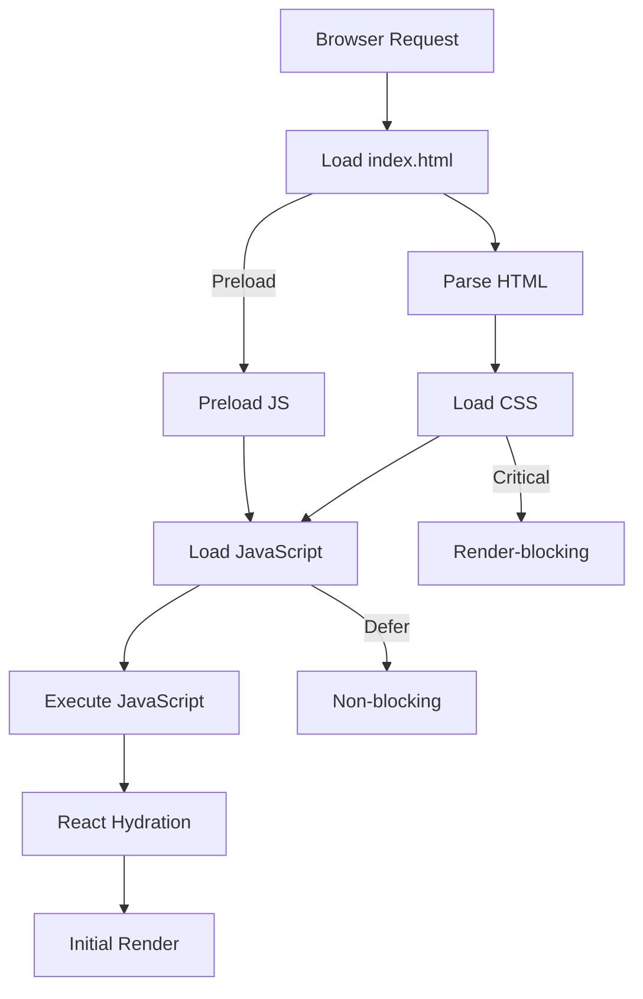

# Application Flow

This document describes the detailed application flow of the Timer Lockout Application, including initialization, user interactions, and state transitions.

---

## 🚀 Initialization Flow

### Application Startup Sequence



### Detailed Initialization Steps

1. **Browser Request**
   - User navigates to application URL
   - Browser requests `index.html`
   - Server returns HTML file

2. **HTML Parsing**
   - Browser parses `index.html`
   - Loads CSS files (if any)
   - Loads JavaScript module (`main.tsx`)

3. **Module Loading**
   - Vite development server serves `main.tsx`
   - Browser downloads and executes the module
   - TypeScript is compiled to JavaScript

4. **React Initialization**
   - `main.tsx` calls `ReactDOM.createRoot()`
   - React initializes and renders `App.tsx`
   - React creates virtual DOM

5. **Component Mounting**
   - `App.tsx` component mounts
   - Custom hooks initialize (`useTimer`)
   - Initial state is set
   - Components render with initial state

6. **UI Display**
   - React updates browser DOM
   - Application becomes visible
   - User can interact with UI

---

## 🖱️ User Interaction Flow

### Start Timer Flow



### Timer Tick Flow



### Lockout Period Flow



### Reset Timer Flow



---

## 🎯 State Transition Flow

### Complete State Machine Flow



---

## 📊 Event Flow

### Timer Events

```mermaid
graph LR
    A[User Action] --> B{Action Type}
    B -->|Start| C[useTimer.start()]
    B -->|Reset| D[useTimer.reset()]
    B -->|Unlock| E[useTimer.unlock()]
    
    C --> F[Set status: running]
    C --> G[Start interval]
    C --> H[Emit START event]
    
    D --> I[Clear interval]
    D --> J[Set status: idle]
    D --> K[Set remainingTime: 180]
    D --> L[Emit RESET event]
    
    E --> M[Clear interval]
    E --> N[Set status: idle]
    E --> O[Set isButtonEnabled: true]
    E --> P[Emit LOCKOUT_END event]
    
    G --> Q[100ms interval]
    Q --> R{Time remaining?}
    R -->|> 0| S[Continue counting]
    R -->|= 0| T[Transition to locked]
    T --> U[Clear interval]
    U --> V[Set lockoutEndTime]
    V --> W[Emit COMPLETE event]
    W --> X[Emit LOCKOUT_START event]
    
    style A fill:#f9f,stroke:#333
    style H fill:#bbf,stroke:#333
    style L fill:#bbf,stroke:#333
    style P fill:#bbf,stroke:#333
    style W fill:#bbf,stroke:#333
```

### Event Subscription Flow



---

## 🎨 Render Flow

### Component Render Flow

```mermaid
flowchart TD
    A[App.tsx] --> B[State from useTimer]
    B --> C{Status}
    
    C -->|idle| D[Show Ready State]
    C -->|running| E[Show Running Timer]
    C -->|locked| F[Show Lockout Message]
    
    D --> G[Enable Start Button]
    D --> H[Show 3:00]
    D --> I[Hide Lockout Message]
    
    E --> J[Disable Button]
    E --> K[Show Countdown]
    E --> L[Show Progress Ring]
    
    F --> M[Disable Button]
    F --> N[Show 0:00]
    F --> O[Show Lockout Message]
    
    G --> P[Button: "Start Timer"]
    J --> Q[Button: "Reset Timer"]
    M --> R[Button: "Reset Timer"]
```

### Data Display Flow

```mermaid
flowchart TD
    A[useTimer State] --> B[remainingTime]
    A --> C[status]
    A --> D[getProgress()]
    A --> E[getFormattedTime()]
    
    B --> F[TimerDisplay: time prop]
    C --> F[TimerDisplay: status prop]
    D --> G[ProgressRing: progress prop]
    E --> H[Technical Details: remaining time]
    
    F --> I[Display formatted time]
    F --> J[Apply status-specific styling]
    G --> K[Render progress ring]
    H --> L[Display in details card]
```

---

## 📈 Performance Flow

### Initial Load Performance



### Optimization Techniques

1. **Code Splitting**
   - Vendor chunk: React and dependencies
   - Application chunk: Application code
   - Benefits: Parallel loading, better caching

2. **Tree Shaking**
   - Remove unused code
   - Benefits: Smaller bundle size

3. **Minification**
   - Minify JavaScript and CSS
   - Benefits: Smaller file sizes, faster downloads

4. **CSS Purging**
   - Remove unused Tailwind classes
   - Benefits: Smaller CSS bundle

5. **Asset Hashing**
   - Content-based filenames
   - Benefits: Cache busting, long cache times

---

## 🔗 Related Documentation

- [system-overview.md](./system-overview.md) - System overview
- [data-flow.md](./data-flow.md) - Data flow details
- [state-management.md](./state-management.md) - State management details
- [error-handling.md](./error-handling.md) - Error handling details
- [decisions.md](./decisions.md) - Architectural decisions
- [../ARCHITECTURE.md](../ARCHITECTURE.md) - Main architecture documentation
- [../PROJECT_STRUCTURE.md](../PROJECT_STRUCTURE.md) - Project structure
