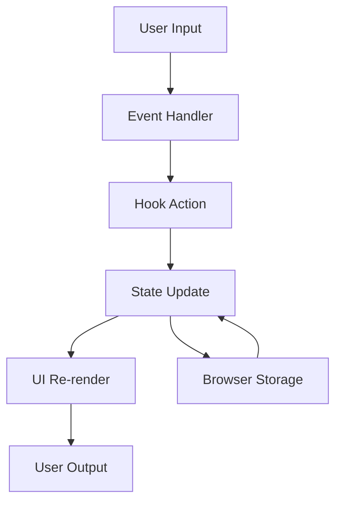
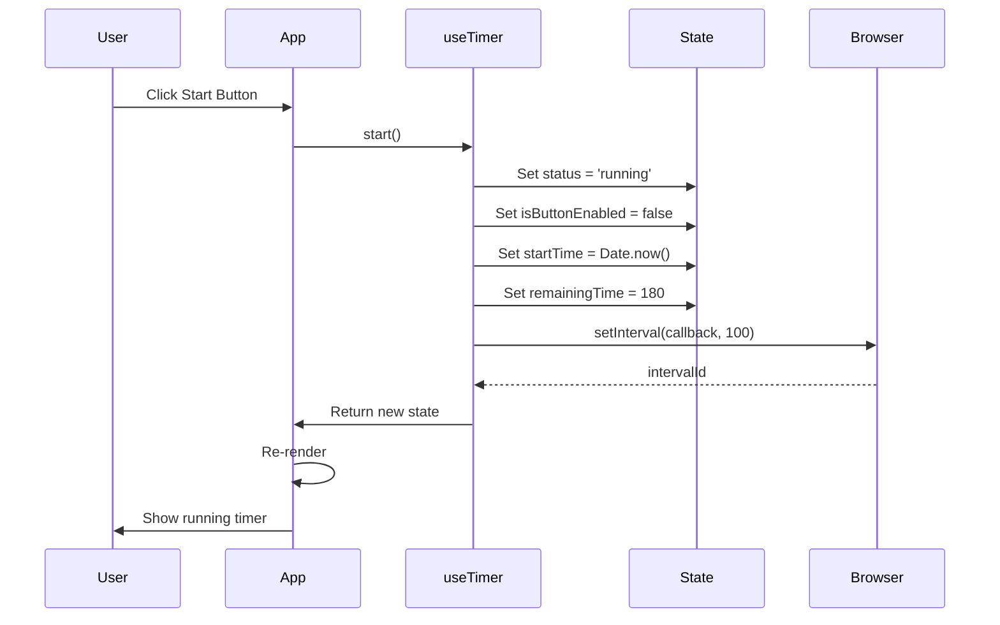
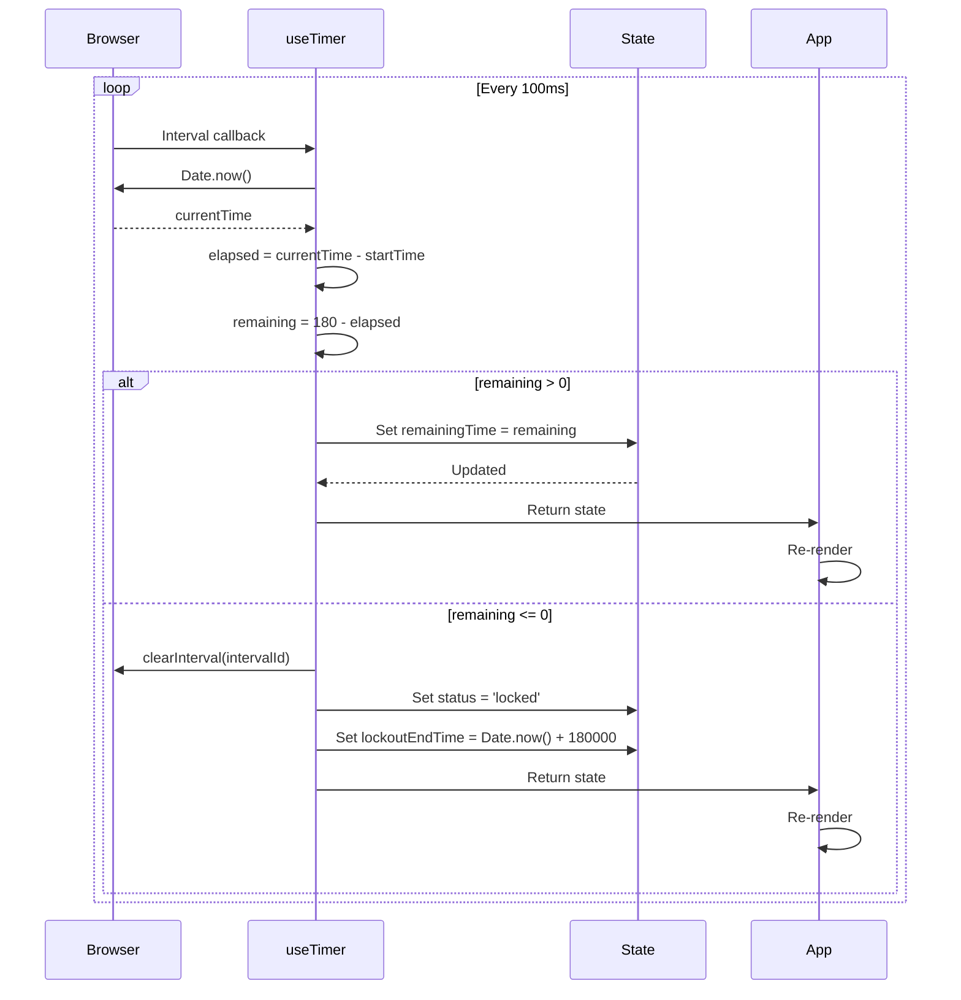
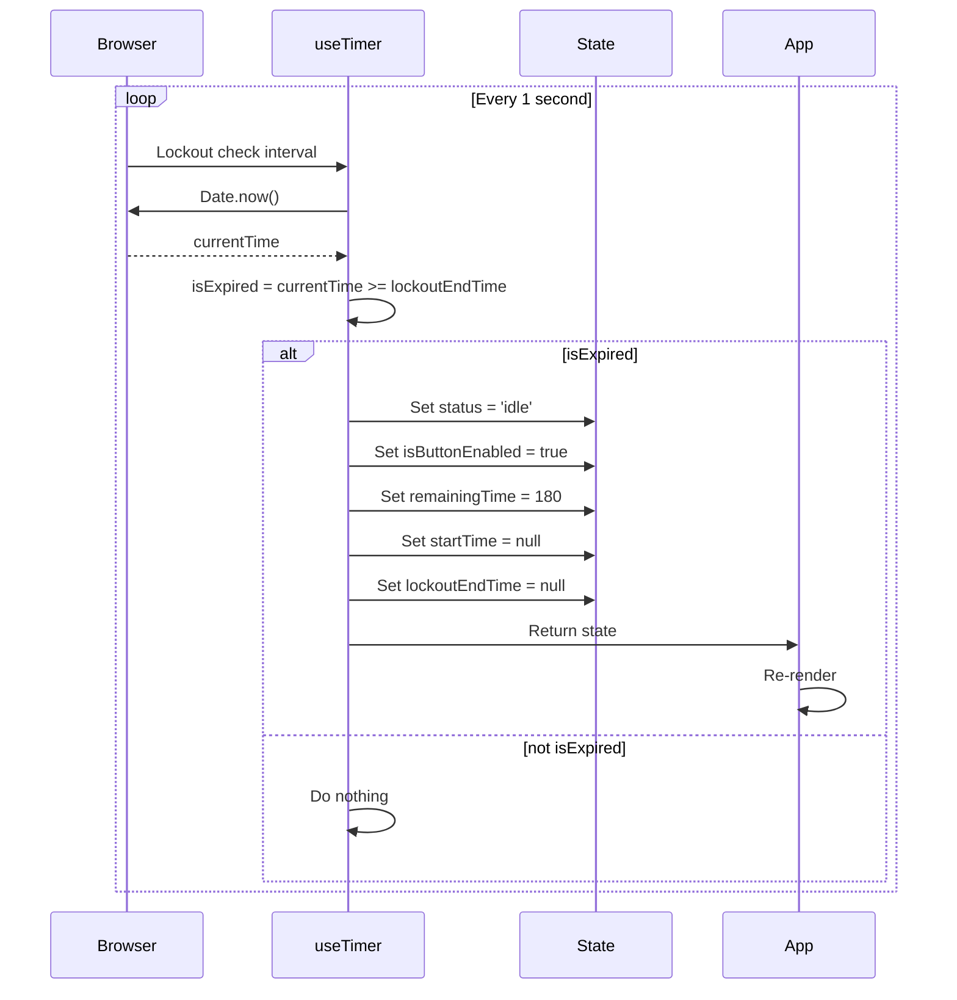
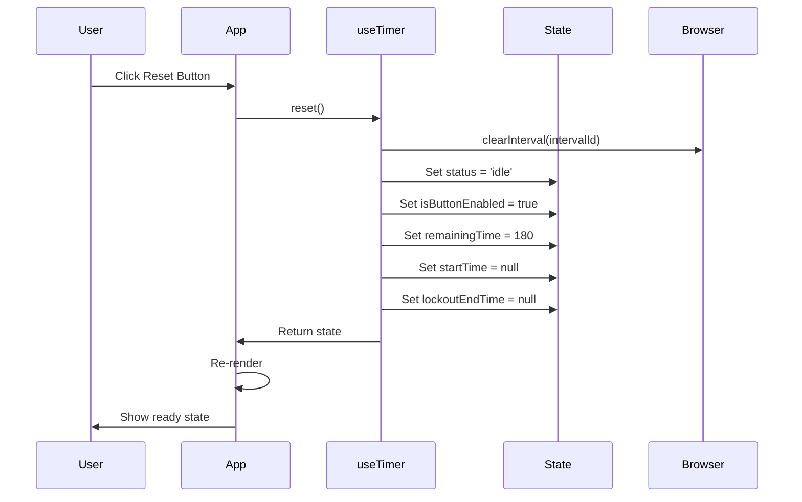
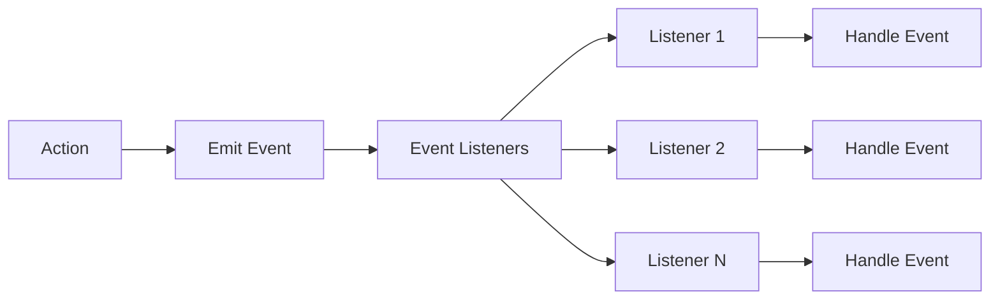

# Data Flow

This document describes how data flows through the Timer Lockout Application, including input validation, transformation, storage, processing, and output.

---

## 📊 Main Data Flow Overview



---

## 🎯 Timer Workflow Data Flow

### Start Timer Workflow

```
Input: User clicks Start button
    ↓
Validation: Button is enabled (state.isButtonEnabled === true)
    ↓
Action: App calls useTimer.start()
    ↓
State Update:
  - status: 'idle' → 'running'
  - isButtonEnabled: true → false
  - startTime: null → Date.now()
  - remainingTime: 180 → 180
    ↓
Side Effect: Start interval (100ms)
    ↓
Output: UI updates to show running timer
```

**Sequence Diagram**:



---

### Timer Tick Workflow

```
Input: 100ms interval tick
    ↓
Calculation:
  - elapsed = Date.now() - startTime
  - remaining = lockoutDuration - elapsed
    ↓
State Update:
  - remainingTime: previous → remaining
    ↓
Condition: remaining <= 0?
    ↓ No
Output: UI updates with new remaining time
    ↓
    ↓ Yes
Action: Clear interval
    ↓
State Update:
  - status: 'running' → 'locked'
  - isButtonEnabled: false → false
  - lockoutEndTime: null → Date.now() + lockoutDuration * 1000
    ↓
Side Effect: Emit COMPLETE and LOCKOUT_START events
    ↓
Output: UI updates to show lockout state
```

**Sequence Diagram**:



---

### Lockout Expiration Workflow

```
Input: 1 second interval (lockout check)
    ↓
Calculation:
  - currentTime = Date.now()
  - isExpired = currentTime >= lockoutEndTime
    ↓
Condition: isExpired?
    ↓ No
Action: Do nothing
    ↓
    ↓ Yes
State Update:
  - status: 'locked' → 'idle'
  - isButtonEnabled: false → true
  - remainingTime: 0 → 180
  - startTime: timestamp → null
  - lockoutEndTime: timestamp → null
    ↓
Side Effect: Emit LOCKOUT_END event
    ↓
Output: UI updates to show ready state
```

**Sequence Diagram**:



---

### Reset Timer Workflow

```
Input: User clicks Reset button
    ↓
Validation: Button is enabled (state.isButtonEnabled === true)
    ↓
Action: App calls useTimer.reset()
    ↓
State Update:
  - status: 'running' or 'locked' → 'idle'
  - isButtonEnabled: false → true
  - remainingTime: any → 180
  - startTime: timestamp → null
  - lockoutEndTime: timestamp → null
    ↓
Side Effect: Clear interval (if running)
    ↓
Side Effect: Emit RESET event
    ↓
Output: UI updates to show ready state
```

**Sequence Diagram**:



---

## 📋 Data Flow Matrix

| Workflow | Input | Validation | Transformation | State | Processing | Output |
|----------|-------|------------|---------------|-------|------------|--------|
| **Start Timer** | Click event | Button enabled | - | status, isButtonEnabled, startTime | Start interval | Running UI |
| **Timer Tick** | Interval | - | Calculate elapsed/remaining | remainingTime | Check if complete | Updated time |
| **Lockout Expiration** | Interval | - | Check expiration | status, isButtonEnabled, etc. | - | Ready UI |
| **Reset Timer** | Click event | Button enabled | - | All state | Clear interval | Ready UI |
| **Unlock Timer** | Click event | Button enabled | - | status, isButtonEnabled | - | Ready UI |

---

## 🔄 Data Transformation Flow

### Time Formatting Flow

```
Input: seconds (number)
    ↓
Validation: isValidNumber(seconds)
    ↓ No
Output: '00:00'
    ↓
    ↓ Yes
Calculation:
  - hrs = Math.floor(seconds / 3600)
  - mins = Math.floor((seconds % 3600) / 60)
  - secs = seconds % 60
    ↓
Condition: showMilliseconds?
    ↓ No
Formatting: `${mins}:${secs.padStart(2, '0')}`
    ↓
    ↓ Yes
Calculation: ms = Math.floor((seconds % 1) * 1000)
    ↓
Formatting: `${hrs > 0 ? hrs + ':' : ''}${mins}:${secs.padStart(2, '0')}.${ms.padStart(3, '0')}`
    ↓
Output: Formatted time string
```

**Code Implementation** (`src/utils/formatTime.ts`):

```typescript
export function formatTime(seconds: number, showMilliseconds: boolean = false): string {
  if (isNaN(seconds) || seconds < 0) {
    return '00:00';
  }

  const totalSeconds = Math.floor(seconds);
  const hrs = Math.floor(totalSeconds / 3600);
  const mins = Math.floor((totalSeconds % 3600) / 60);
  const secs = totalSeconds % 60;

  if (showMilliseconds) {
    const ms = Math.floor((seconds % 1) * 1000);
    if (hrs > 0) {
      return `${hrs}:${String(mins).padStart(2, '0')}:${String(secs).padStart(2, '0')}.${String(ms).padStart(3, '0')}`;
    }
    return `${mins}:${String(secs).padStart(2, '0')}.${String(ms).padStart(3, '0')}`;
  }

  if (hrs > 0) {
    return `${hrs}:${String(mins).padStart(2, '0')}:${String(secs).padStart(2, '0')}`;
  }

  return `${mins}:${String(secs).padStart(2, '0')}`;
}
```

---

### Progress Calculation Flow

```
Input: state (TimerState)
    ↓
Condition: state.status === 'running' && lockoutDuration > 0
    ↓ No
Output: 0
    ↓
    ↓ Yes
Calculation:
  - elapsed = lockoutDuration - state.remainingTime
  - progress = (elapsed / lockoutDuration) * 100
    ↓
Output: Math.min(100, Math.max(0, progress))
```

**Code Implementation** (`src/hooks/useTimer.ts`):

```typescript
const getProgress = useCallback((): number => {
  if (state.status !== 'running' || lockoutDuration <= 0) {
    return 0;
  }
  const elapsed = lockoutDuration - state.remainingTime;
  return (elapsed / lockoutDuration) * 100;
}, [state.status, state.remainingTime, lockoutDuration]);
```

---

## 🗃️ State Flow

### State Structure

```typescript
interface TimerState {
  status: TimerStatus;           // Current timer status
  remainingTime: number;         // Time remaining in seconds
  startTime: number | null;      // When timer started
  lockoutEndTime: number | null; // When lockout ends
  isButtonEnabled: boolean;      // Whether action button is enabled
}

type TimerStatus = 'idle' | 'running' | 'locked' | 'completed';
```

### State Transitions

| From | To | Trigger | Conditions |
|------|----|---------|------------|
| idle | running | start() | isButtonEnabled === true |
| running | idle | reset() | Any time |
| running | locked | Timer expires | remainingTime <= 0 |
| locked | idle | unlock() | Any time |
| locked | idle | reset() | Any time |
| locked | idle | Lockout expires | Date.now() >= lockoutEndTime |

### State Update Flow

```
Input: Action (start, reset, unlock, timer tick)
    ↓
Calculate New State:
  - Update status
  - Update remainingTime
  - Update startTime
  - Update lockoutEndTime
  - Update isButtonEnabled
    ↓
Set State: useState setter
    ↓
Trigger Re-render: React detects state change
    ↓
Output: UI updates with new state
```

---

## 🔌 Event Flow

### Event System

The application uses a **custom event system** through the `useTimer` hook:

```typescript
const eventListeners = useRef<Set<(event: TimerEvent) => void>>(new Set());

const subscribe = useCallback((callback: (event: TimerEvent) => void) => {
  eventListeners.current.add(callback);
  return () => {
    eventListeners.current.delete(callback);
  };
}, []);

const emitEvent = useCallback((event: TimerEvent) => {
  eventListeners.current.forEach(listener => {
    try {
      listener(event);
    } catch (error) {
      console.error('Error in timer event listener:', error);
    }
  });
}, []);
```

### Event Types

```typescript
type TimerEvent = 
  | { type: 'START' }
  | { type: 'PAUSE' }
  | { type: 'RESET' }
  | { type: 'COMPLETE' }
  | { type: 'LOCKOUT_START' }
  | { type: 'LOCKOUT_END' };
```

### Event Flow Diagram



### Event Emission Points

| Event | Emitted When | Emitted By |
|-------|--------------|------------|
| START | Timer starts | useTimer.start() |
| PAUSE | Timer pauses | useTimer.pause() |
| RESET | Timer resets | useTimer.reset() |
| COMPLETE | Timer completes | useTimer interval callback |
| LOCKOUT_START | Lockout begins | useTimer interval callback |
| LOCKOUT_END | Lockout ends | Lockout check interval |

---

## 📥 Input/Output Flow

### User Input Flow

```
Input: User action (click, keyboard)
    ↓
Browser Event: onClick, onKeyDown
    ↓
Component Event Handler: handleClick, handleKeyDown
    ↓
Validation: Check if action is allowed
    ↓
Action: Call appropriate hook function
    ↓
State Update: Modify application state
    ↓
Re-render: React updates UI
    ↓
Output: User sees updated UI
```

### Keyboard Shortcut Flow

```
Input: Keyboard event
    ↓
Event Handler: handleKeyDown (in App.tsx)
    ↓
Condition Check:
  - Space/Enter: start/reset if button enabled
  - Escape: reset
  - 'i'/'I': toggle instructions
    ↓
Action: Call appropriate function
    ↓
Prevent Default: e.preventDefault()
    ↓
Output: Action executed
```

**Code Implementation** (`src/App.tsx`):

```typescript
useEffect(() => {
  const handleKeyDown = (e: KeyboardEvent) => {
    if (state.isButtonEnabled && (e.key === ' ' || e.key === 'Enter')) {
      if (state.status === 'idle') {
        start();
      } else {
        reset();
      }
      e.preventDefault();
    }
    
    if (e.key === 'Escape') {
      reset();
      e.preventDefault();
    }
    
    if (e.key === 'i' || e.key === 'I') {
      setShowInstructions(prev => !prev);
      e.preventDefault();
    }
  };

  window.addEventListener('keydown', handleKeyDown);
  return () => window.removeEventListener('keydown', handleKeyDown);
}, [state.status, state.isButtonEnabled, start, reset]);
```

---

## 🔗 Related Documentation

- [system-overview.md](./system-overview.md) - System overview
- [application-flow.md](./application-flow.md) - Application flow details
- [state-management.md](./state-management.md) - State management details
- [error-handling.md](./error-handling.md) - Error handling details
- [decisions.md](./decisions.md) - Architectural decisions
- [../ARCHITECTURE.md](../ARCHITECTURE.md) - Main architecture documentation
- [../PROJECT_STRUCTURE.md](../PROJECT_STRUCTURE.md) - Project structure
