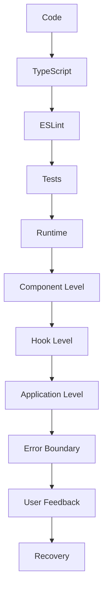

# Error Handling

This document describes the error handling architecture of the Timer Lockout Application, including error prevention, detection, handling, and recovery strategies.

---

## 🛡️ Error Handling Overview

The Timer Lockout Application implements a **multi-layer error handling** strategy to ensure reliability and provide a good user experience. The approach includes:

1. **Error Prevention**: Type safety, validation, and best practices
2. **Error Detection**: Runtime checks and monitoring
3. **Error Handling**: Graceful degradation and user feedback
4. **Error Recovery**: Automatic and manual recovery options
5. **Error Reporting**: Logging and debugging information

### Error Handling Layers



---

## 🚫 Error Prevention

### Type Safety

**Mechanism**: TypeScript static type checking

**Implementation**:
- All files use TypeScript
- Strict mode enabled
- No implicit any
- Type annotations for all variables and functions

**Example**:
```typescript
// TypeScript catches this at compile time
const seconds: number = "180"; // Error: Type 'string' is not assignable to type 'number'
```

**Benefits**:
- Catches type errors at compile time
- Improves code maintainability
- Provides better IDE support
- Prevents many runtime errors

### Linting

**Mechanism**: ESLint with comprehensive rules

**Implementation**:
- ESLint configured with TypeScript and React plugins
- Rules for common error patterns
- Pre-commit hooks (recommended)

**Example Rules**:
- `no-unused-vars`: Catch unused variables
- `@typescript-eslint/no-explicit-any`: Prevent implicit any
- `react-hooks/exhaustive-deps`: Catch missing dependencies

**Benefits**:
- Catches potential issues early
- Enforces code quality standards
- Prevents common mistakes

### Testing

**Mechanism**: Comprehensive unit test suite

**Implementation**:
- 90 tests covering all major functionality
- Tests for edge cases and error conditions
- Tests for invalid inputs

**Benefits**:
- Verifies expected behavior
- Catches regressions
- Provides confidence in code changes

---

## 🔍 Error Detection

### Input Validation

**Mechanism**: Validate all external inputs

**Implementation**:
- Type guards for function parameters
- Default values for optional parameters
- Range checks for numeric inputs

**Example** (`src/utils/formatTime.ts`):
```typescript
export function formatTime(seconds: number, showMilliseconds: boolean = false): string {
  // Validate input
  if (isNaN(seconds) || seconds < 0) {
    return '00:00'; // Safe default
  }
  
  // Process valid input
  const totalSeconds = Math.floor(seconds);
  // ...
}

export function isValidNumber(value: unknown): value is number {
  return typeof value === 'number' && !isNaN(value) && isFinite(value);
}
```

**Benefits**:
- Prevents invalid data from causing errors
- Provides safe defaults
- Clear error handling

### Runtime Checks

**Mechanism**: Check for error conditions at runtime

**Implementation**:
- Null/undefined checks
- Range validation
- State validation

**Example**:
```typescript
// Check if timer is running before clearing
const clearTimer = useCallback(() => {
  if (timerRef.current) {
    window.clearInterval(timerRef.current);
    timerRef.current = null;
  }
}, []);
```

---

## 🛠️ Error Handling

### Component-Level Error Handling

**Mechanism**: Individual components handle their own errors

**Implementation**:
- Try/catch in component methods
- Error states in component state
- User feedback for component errors

**Example**:
```typescript
const handleClick = () => {
  try {
    // Do something that might fail
  } catch (error) {
    setError('An error occurred');
    console.error('Component error:', error);
  }
};
```

### Hook-Level Error Handling

**Mechanism**: Custom hooks handle errors internally

**Implementation**:
- Try/catch in hook functions
- Safe defaults for error cases
- Error events for subscribers

**Example** (`src/hooks/useTimer.ts`):
```typescript
const emitEvent = useCallback((event: TimerEvent) => {
  eventListeners.current.forEach(listener => {
    try {
      listener(event);
    } catch (error) {
      console.error('Error in timer event listener:', error);
    }
  });
}, []);
```

**Benefits**:
- Prevents one listener error from affecting others
- Provides debugging information
- Maintains application stability

### Application-Level Error Handling

**Mechanism**: ErrorBoundary component catches unhandled errors

**Implementation**: `src/components/ErrorBoundary.tsx`

```typescript
export class ErrorBoundary extends Component<Props, State> {
  static getDerivedStateFromError(error: Error): State {
    return { hasError: true, error };
  }

  componentDidCatch(error: Error, errorInfo: ErrorInfo): void {
    console.error('ErrorBoundary caught an error:', error, errorInfo);
  }

  render(): ReactNode {
    if (this.state.hasError) {
      return (
        <div className="error-fallback">
          <h2>Something went wrong</h2>
          <p>Please try refreshing the page.</p>
          <button onClick={() => window.location.reload()}>Refresh</button>
          {this.state.error && (
            <details>
              <summary>Technical Details</summary>
              <pre>{this.state.error.message}</pre>
            </details>
          )}
        </div>
      );
    }
    return this.props.children;
  }
}
```

**Features**:
- ✅ Catches errors in component tree
- ✅ Displays user-friendly error message
- ✅ Provides refresh option
- ✅ Shows technical details (expandable)
- ✅ Logs errors to console
- ✅ Accessible (ARIA attributes)

**Usage**:
```typescript
// In App.tsx
<ErrorBoundary>
  <App />
</ErrorBoundary>
```

---

## 🔄 Error Recovery

### Automatic Recovery

**Mechanism**: Application recovers automatically from certain errors

**Implementations**:
- ErrorBoundary allows page refresh
- Hooks maintain consistent state
- Safe defaults prevent crashes

**Example**:
```typescript
// In ErrorBoundary
<button onClick={() => window.location.reload()}>Refresh Page</button>
```

### Manual Recovery

**Mechanism**: User can take action to recover

**Implementations**:
- Refresh button in ErrorBoundary
- Reset button for timer
- Clear state options

**Example**:
```typescript
// User can reset the timer
<Button onClick={reset} disabled={!state.isButtonEnabled}>
  Reset Timer
</Button>
```

---

## 📝 Error Reporting

### Console Logging

**Mechanism**: Log errors to browser console

**Implementation**:
- `console.error()` for errors
- `console.warn()` for warnings
- `console.log()` for debugging

**Example**:
```typescript
console.error('Error in timer:', error);
```

**Note**: Console logging is automatically removed in production builds by Vite.

### Error Details

**Mechanism**: Provide technical details for debugging

**Implementation**:
- ErrorBoundary shows error message and stack trace
- Console logging with context
- Source maps for production debugging

**Example**:
```typescript
// In ErrorBoundary
<details>
  <summary>Technical Details</summary>
  <pre className="text-xs">
    {this.state.error.message}
    {this.state.error.stack}
  </pre>
</details>
```

---

## 📊 Error Handling Matrix

| Error Type | Prevention | Detection | Handling | Recovery | Reporting |
|------------|------------|-----------|----------|----------|-----------|
| **Type Errors** | TypeScript | Compile-time | N/A | N/A | N/A |
| **Null/Undefined** | TypeScript, defaults | Runtime | Safe defaults | Automatic | Console |
| **Invalid Input** | Validation | Runtime | Safe defaults | Automatic | Console |
| **Component Errors** | Tests, linting | Runtime | ErrorBoundary | Manual (refresh) | Console, UI |
| **Hook Errors** | Tests, linting | Runtime | Try/catch | Automatic | Console |
| **Network Errors** | N/A | Runtime | Graceful degradation | Manual (retry) | Console, UI |
| **Build Errors** | Tests, linting | Build-time | Fix and rebuild | N/A | Terminal |

---

## 🎯 Error Handling Strategies by Component

### App Component

**Error Handling**:
- Wrapped in ErrorBoundary
- Keyboard event handler try/catch
- State validation

**Example**:
```typescript
// In App.tsx
<ErrorBoundary>
  <Suspense fallback={<LoadingSpinner label="Loading application" />}>
    <AppContent />
  </Suspense>
</ErrorBoundary>
```

### useTimer Hook

**Error Handling**:
- Try/catch in event emission
- Safe state updates
- Interval cleanup

**Example**:
```typescript
// Clear timer safely
const clearTimer = useCallback(() => {
  if (timerRef.current) {
    window.clearInterval(timerRef.current);
    timerRef.current = null;
  }
}, []);
```

### TimerDisplay Component

**Error Handling**:
- Safe formatting of time values
- Fallback for invalid inputs

**Example**:
```typescript
// In TimerDisplay.tsx
const formattedTime = formatTime(time, showMilliseconds);
// formatTime handles invalid inputs safely
```

### Button Component

**Error Handling**:
- Disabled state prevents invalid actions
- Loading state prevents duplicate actions

**Example**:
```typescript
<Button
  disabled={isDisabled}
  isLoading={isLoading}
  onClick={handleClick}
>
  {children}
</Button>
```

---

## 🛡️ Error Handling Best Practices

### 1. Prevent Errors First

- Use TypeScript for type safety
- Validate all inputs
- Follow best practices
- Write comprehensive tests

### 2. Handle Errors Gracefully

- Use try/catch for async operations
- Provide safe defaults
- Show user-friendly messages
- Don't crash the application

### 3. Log Errors Appropriately

- Use appropriate log levels (error, warn, log)
- Include context in error messages
- Log to console for debugging
- Consider external error tracking

### 4. Provide Recovery Options

- Allow users to refresh/retry
- Provide clear error messages
- Suggest solutions when possible

### 5. Test Error Conditions

- Test with invalid inputs
- Test edge cases
- Test error paths
- Verify error messages

---

## 📊 Known Error Scenarios

### Scenario 1: Invalid Lockout Duration

**Cause**: Environment variable set to non-numeric value

**Prevention**:
```typescript
const lockoutDuration = Number(import.meta.env.VITE_LOCKOUT_DURATION) || 180;
```

**Handling**: Safe default (180 seconds)

**Recovery**: Automatic (uses default)

---

### Scenario 2: Timer Interval Not Cleared

**Cause**: Component unmounts without clearing interval

**Prevention**:
```typescript
useEffect(() => {
  const interval = window.setInterval(() => {
    // ...
  }, 100);

  return () => {
    window.clearInterval(interval);
  };
}, []);
```

**Handling**: Cleanup function in useEffect

**Recovery**: Automatic (cleanup on unmount)

---

### Scenario 3: Event Listener Error

**Cause**: Subscriber throws error

**Prevention**:
```typescript
const emitEvent = useCallback((event: TimerEvent) => {
  eventListeners.current.forEach(listener => {
    try {
      listener(event);
    } catch (error) {
      console.error('Error in timer event listener:', error);
    }
  });
}, []);
```

**Handling**: Try/catch in event emission

**Recovery**: Automatic (other listeners still work)

---

### Scenario 4: Component Render Error

**Cause**: Error in component render method

**Prevention**:
- TypeScript type checking
- Comprehensive tests
- Code reviews

**Handling**: ErrorBoundary catches error

**Recovery**: Manual (user refreshes page)

---

## 🔗 Related Documentation

- [system-overview.md](./system-overview.md) - System overview
- [application-flow.md](./application-flow.md) - Application flow details
- [data-flow.md](./data-flow.md) - Data flow details
- [state-management.md](./state-management.md) - State management details
- [decisions.md](./decisions.md) - Architectural decisions
- [../ARCHITECTURE.md](../ARCHITECTURE.md) - Main architecture documentation
- [../PROJECT_STRUCTURE.md](../PROJECT_STRUCTURE.md) - Project structure
- [../SECURITY.md](../SECURITY.md) - Security considerations
- [../TROUBLESHOOTING.md](../TROUBLESHOOTING.md) - Troubleshooting guide
