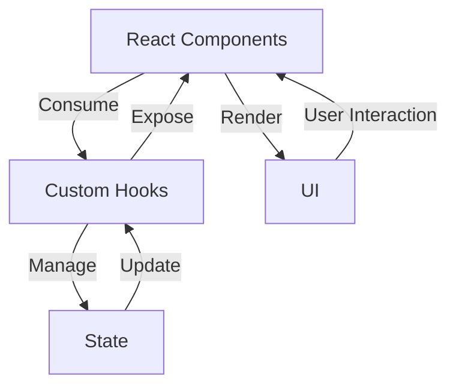
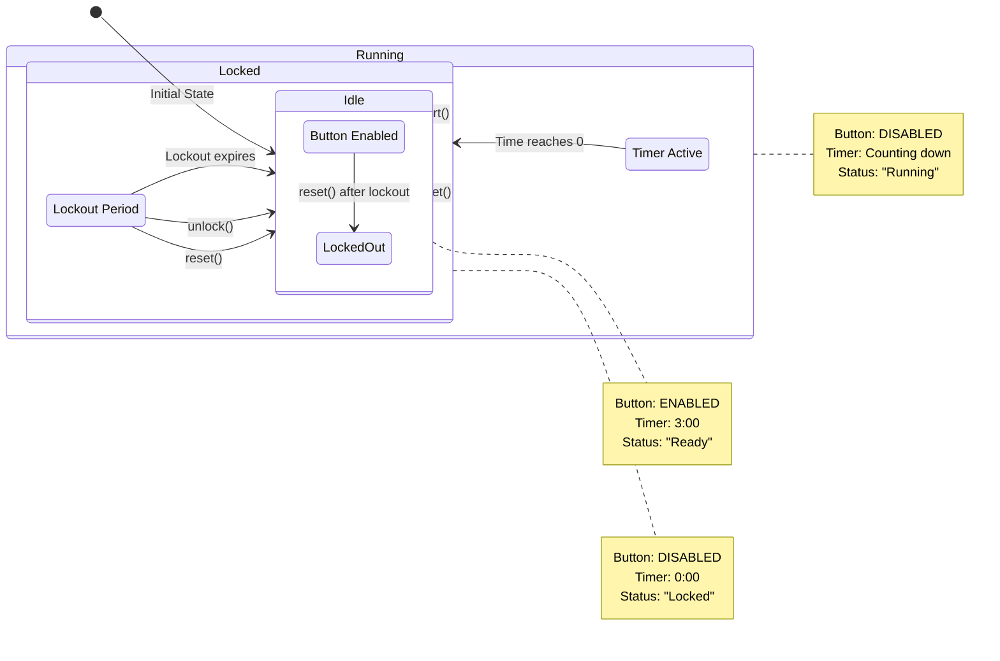
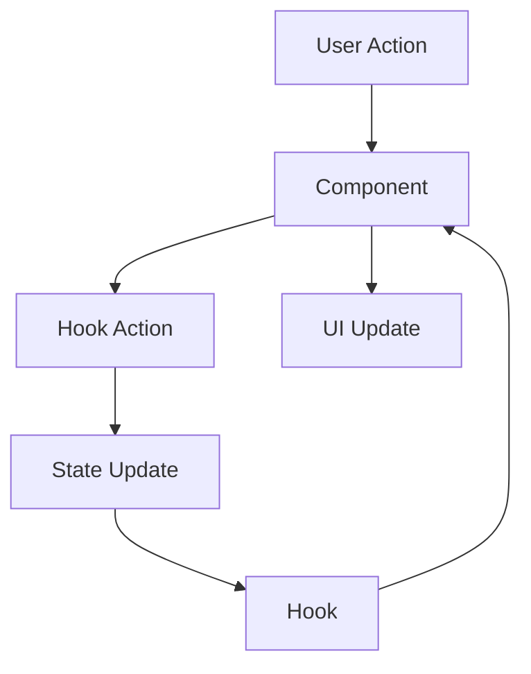
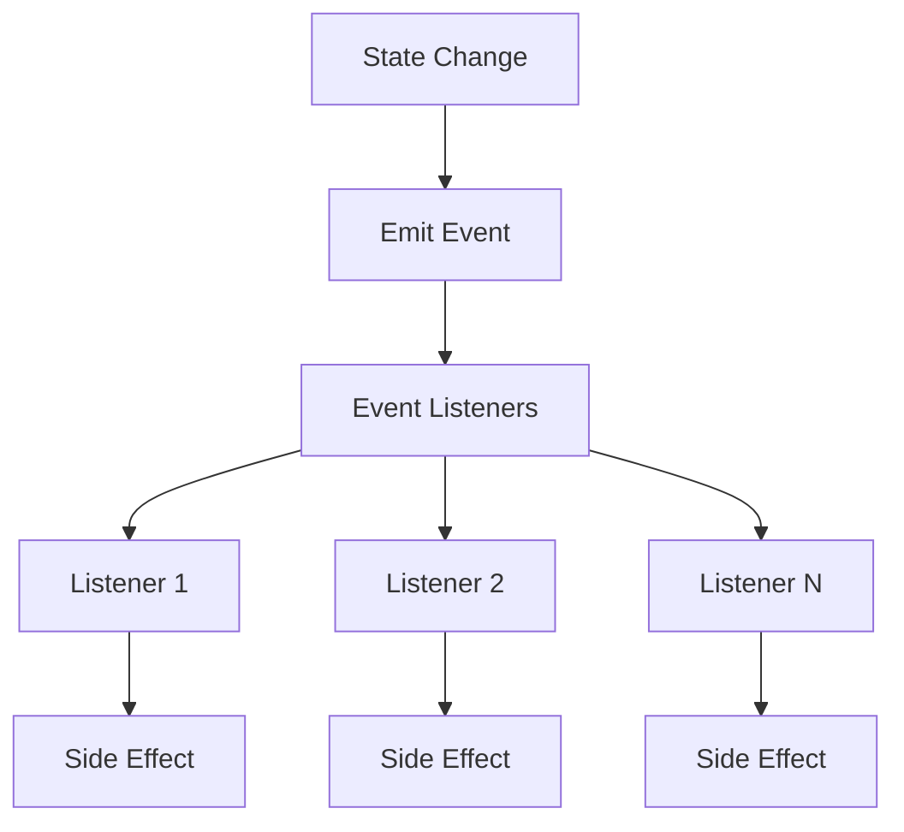

# State Management

This document describes the state management architecture of the Timer Lockout Application, including state structure, state transitions, and state management patterns.

---

## 🎯 State Management Overview

The Timer Lockout Application uses a **centralized state management** approach through React's custom hooks. This provides a clean, maintainable, and testable architecture.

### State Management Architecture



### Key Principles

1. **Centralized State**: Timer state is managed in a single hook (`useTimer`)
2. **Component Isolation**: Components receive state via props and don't manage it directly
3. **Immutable Updates**: State updates are immutable (new object for each update)
4. **Event-Driven**: State changes can emit events to subscribers
5. **Type Safety**: All state is strongly typed with TypeScript

---

## 📦 State Structure

### Timer State Interface

```typescript
// Location: src/types/index.ts

export type TimerStatus = 'idle' | 'running' | 'locked' | 'completed';

export interface TimerState {
  status: TimerStatus;           // Current timer status
  remainingTime: number;         // Time remaining in seconds
  startTime: number | null;      // Timestamp when timer started
  lockoutEndTime: number | null; // Timestamp when lockout ends
  isButtonEnabled: boolean;      // Whether action button is enabled
}
```

### State Properties

| Property | Type | Description | Initial Value | Possible Values |
|----------|------|-------------|---------------|----------------|
| `status` | TimerStatus | Current timer state | 'idle' | 'idle', 'running', 'locked', 'completed' |
| `remainingTime` | number | Time remaining in seconds | 180 | 0 to lockoutDuration |
| `startTime` | number \| null | When timer started | null | Date.now() timestamp or null |
| `lockoutEndTime` | number \| null | When lockout ends | null | Date.now() + lockoutDuration * 1000 or null |
| `isButtonEnabled` | boolean | Whether button is enabled | true | true or false |

---

## 🔄 State Transitions

### State Transition Diagram



### State Transition Table

| Current State | Action | Next State | Conditions | Side Effects |
|---------------|--------|------------|------------|--------------|
| idle | start() | running | isButtonEnabled === true | Start interval, emit START |
| idle | reset() | idle | Always | None |
| idle | unlock() | idle | Always | None |
| running | start() | running | isButtonEnabled === false | Ignored |
| running | reset() | idle | Always | Clear interval, emit RESET |
| running | unlock() | idle | Always | Clear interval, emit LOCKOUT_END |
| running | Timer expires | locked | remainingTime <= 0 | Clear interval, emit COMPLETE, LOCKOUT_START |
| locked | start() | locked | isButtonEnabled === false | Ignored |
| locked | reset() | idle | Always | Clear lockout, emit RESET |
| locked | unlock() | idle | Always | Clear lockout, emit LOCKOUT_END |
| locked | Lockout expires | idle | Date.now() >= lockoutEndTime | Clear lockout, emit LOCKOUT_END |

---

## 🏗️ State Management Implementation

### useTimer Hook

**Location**: `src/hooks/useTimer.ts`

**Purpose**: Centralized timer state management

**Implementation**:

```typescript
export function useTimer(lockoutDuration: number = DEFAULT_LOCKOUT_DURATION) {
  const [state, setState] = useState<TimerState>({
    status: 'idle',
    remainingTime: lockoutDuration,
    startTime: null,
    lockoutEndTime: null,
    isButtonEnabled: true,
  });

  // ... actions and effects

  return {
    state,
    start,
    pause,
    reset,
    unlock,
    subscribe,
    getProgress,
    getFormattedTime,
  };
}
```

### State Management Features

1. **Initialization**:
   - State initialized with default values
   - lockoutDuration can be customized

2. **Actions**:
   - `start()`: Start the timer
   - `pause()`: Pause the timer
   - `reset()`: Reset to initial state
   - `unlock()`: Clear lockout manually

3. **Event System**:
   - `subscribe(callback)`: Subscribe to timer events
   - `emitEvent(event)`: Emit events to subscribers

4. **Utilities**:
   - `getProgress()`: Get progress percentage
   - `getFormattedTime()`: Get formatted time string

---

## 📊 State Update Patterns

### Start Action

```typescript
const start = useCallback(() => {
  clearTimer();
  
  const newStartTime = Date.now();
  const newState: TimerState = {
    status: 'running',
    remainingTime: lockoutDuration,
    startTime: newStartTime,
    lockoutEndTime: null,
    isButtonEnabled: false,
  };

  setState(newState);
  emitEvent({ type: 'START' });

  timerRef.current = window.setInterval(() => {
    setState(prev => {
      const elapsed = (Date.now() - (prev.startTime || newStartTime)) / 1000;
      const remaining = lockoutDuration - elapsed;

      if (remaining <= 0) {
        clearTimer();
        const lockoutEndTime = Date.now() + lockoutDuration * 1000;
        const completedState: TimerState = {
          status: 'locked',
          remainingTime: 0,
          startTime: null,
          lockoutEndTime,
          isButtonEnabled: false,
        };
        emitEvent({ type: 'COMPLETE' });
        emitEvent({ type: 'LOCKOUT_START' });
        return completedState;
      }

      return {
        ...prev,
        remainingTime: remaining,
      };
    });
  }, 100);
}, [clearTimer, lockoutDuration, emitEvent]);
```

**Flow**:
1. Clear any existing timer
2. Set new state with 'running' status
3. Emit START event
4. Start interval to update remaining time
5. On each interval:
   - Calculate elapsed time
   - Calculate remaining time
   - If remaining <= 0:
     - Clear interval
     - Set locked state
     - Emit COMPLETE and LOCKOUT_START events
   - Else:
     - Update remainingTime

---

### Reset Action

```typescript
const reset = useCallback(() => {
  clearTimer();
  const newState: TimerState = {
    status: 'idle',
    remainingTime: lockoutDuration,
    startTime: null,
    lockoutEndTime: null,
    isButtonEnabled: true,
  };
  setState(newState);
  emitEvent({ type: 'RESET' });
}, [clearTimer, lockoutDuration, emitEvent]);
```

**Flow**:
1. Clear any existing timer
2. Set new state with 'idle' status
3. Reset all values to initial state
4. Emit RESET event

---

### Lockout Check

```typescript
useEffect(() => {
  if (state.status === 'locked' && state.lockoutEndTime) {
    const checkLockout = () => {
      const now = Date.now();
      if (now >= state.lockoutEndTime!) {
        unlock();
      }
    };

    const interval = window.setInterval(checkLockout, 1000);
    checkLockout(); // Check immediately

    return () => window.clearInterval(interval);
  }
}, [state.status, state.lockoutEndTime, unlock]);
```

**Flow**:
1. Check if status is 'locked' and lockoutEndTime is set
2. Start interval to check lockout expiration
3. On each check:
   - Get current time
   - If current time >= lockoutEndTime:
     - Call unlock()
4. Clean up interval on unmount or status change

---

## 🔄 State Flow Patterns

### Unidirectional Data Flow



1. **User Action**: User interacts with UI (click, keyboard)
2. **Component**: Component receives event
3. **Hook Action**: Component calls hook action function
4. **State Update**: Hook updates state
5. **Hook**: Hook returns new state
6. **Component**: Component re-renders with new state
7. **UI Update**: UI reflects new state

### Event-Driven Updates



1. **State Change**: State is updated
2. **Emit Event**: Hook emits event to subscribers
3. **Event Listeners**: All subscribers receive event
4. **Side Effect**: Each listener can perform side effects

---

## 🛡️ State Safety

### Immutability

All state updates follow React's immutability principle:
- New state object is created for each update
- Previous state is never mutated
- Spread operator used to copy previous state

**Example**:
```typescript
setState(prev => ({
  ...prev,        // Copy previous state
  remainingTime: remaining,  // Update specific property
}));
```

### Type Safety

All state properties are strongly typed:
- `TimerState` interface defines structure
- `TimerStatus` type defines valid status values
- TypeScript validates all state updates

**Benefits**:
- Compile-time validation
- Better developer experience
- Prevents runtime errors
- Clear documentation

### Default Values

All state properties have safe default values:
- `status`: 'idle' (clear initial state)
- `remainingTime`: lockoutDuration (full time)
- `startTime`: null (no timer running)
- `lockoutEndTime`: null (no lockout)
- `isButtonEnabled`: true (button enabled)

---

## 📊 State Management Benefits

### Benefits of This Approach

| Benefit | Description |
|---------|-------------|
| **Centralized** | All timer state in one place |
| **Reusable** | Hook can be used by multiple components |
| **Testable** | Hook can be tested in isolation |
| **Maintainable** | Clear separation of concerns |
| **Type-Safe** | TypeScript ensures type correctness |
| **Event-Driven** | Components can react to state changes |
| **React-Native** | Uses React's built-in state management |

### Comparison with Alternatives

| Approach | Pros | Cons | Chosen? |
|----------|------|------|---------|
| **Custom Hook** | Simple, React-native, reusable | Limited to single component tree | ✅ Yes |
| **Context API** | Global state, built-in | Overkill for single feature | ❌ No |
| **Redux** | Global state, middleware | Too heavy, complex | ❌ No |
| **MobX** | Reactive, simple | External dependency | ❌ No |
| **Zustand** | Simple, flexible | External dependency | ❌ No |
| **Local State** | Simple, built-in | Not reusable | ❌ No |

---

## 🔧 State Management Best Practices

### 1. Keep State Minimal

- Only store what's necessary in state
- Derive values from state when possible
- Use memoization for expensive derivations

**Example**:
```typescript
// Good: Derive progress from state
const progress = useMemo(() => {
  return (elapsed / lockoutDuration) * 100;
}, [elapsed, lockoutDuration]);

// Bad: Store progress in state (redundant)
```

### 2. Use Clear State Structure

- Define interfaces for complex state
- Use descriptive property names
- Document state structure

### 3. Handle State Updates Carefully

- Use functional updates when new state depends on previous
- Avoid race conditions
- Handle edge cases

**Example**:
```typescript
// Good: Functional update
setState(prev => ({
  ...prev,
  remainingTime: prev.remainingTime - 1,
}));

// Bad: May cause race conditions
setState({
  ...state,
  remainingTime: state.remainingTime - 1,
});
```

### 4. Use Events for Side Effects

- Emit events when state changes
- Allow components to react to changes
- Keep side effects separate from state updates

### 5. Clean Up Resources

- Clear intervals on unmount
- Clean up event listeners
- Prevent memory leaks

**Example**:
```typescript
useEffect(() => {
  const interval = window.setInterval(() => {
    // Do something
  }, 1000);

  return () => {
    window.clearInterval(interval);
  };
}, []);
```

---

## 📚 Related Documentation

- [system-overview.md](./system-overview.md) - System overview
- [application-flow.md](./application-flow.md) - Application flow details
- [data-flow.md](./data-flow.md) - Data flow details
- [error-handling.md](./error-handling.md) - Error handling details
- [decisions.md](./decisions.md) - Architectural decisions
- [../ARCHITECTURE.md](../ARCHITECTURE.md) - Main architecture documentation
- [../PROJECT_STRUCTURE.md](../PROJECT_STRUCTURE.md) - Project structure
