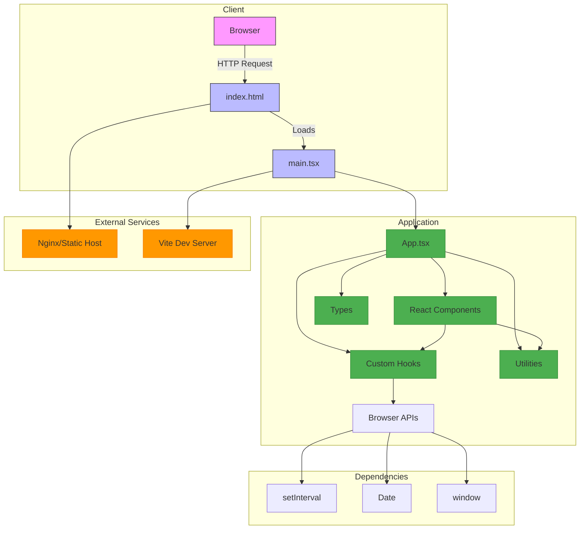
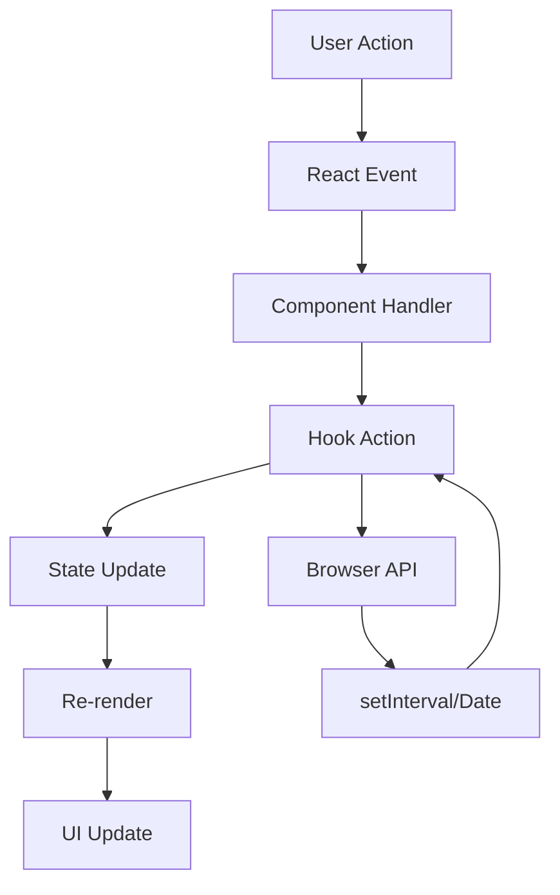
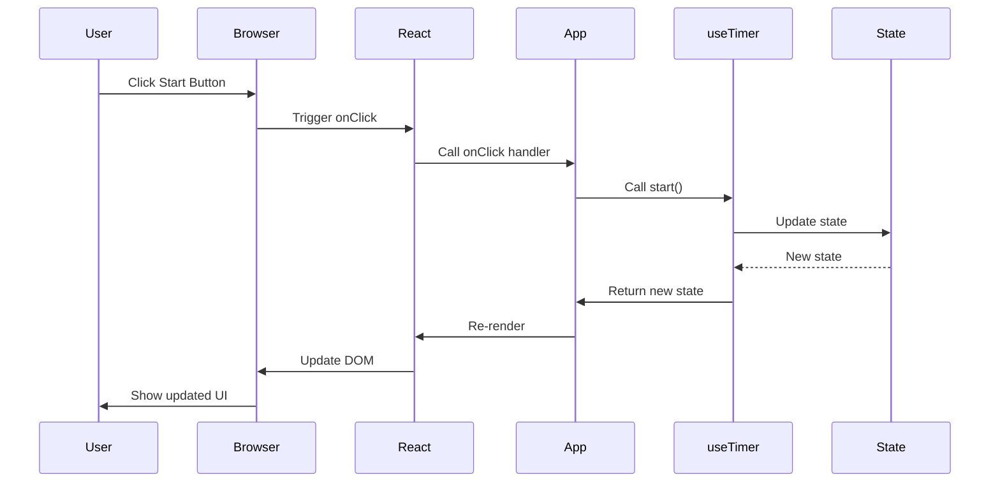

# System Overview

This document provides a high-level overview of the Timer Lockout Application architecture, including system components, their relationships, and the overall design philosophy.

---

## 🏗️ System Architecture Diagram

---

## 🎯 System Components

### 1. Client Layer

**Components**:
- Web Browser (Chrome, Firefox, Safari, Edge)
- Mobile Browsers (Safari for iOS, Chrome for Android)

**Responsibilities**:
- Render HTML, CSS, and JavaScript
- Handle user interactions
- Manage DOM
- Execute JavaScript

**Technologies**:
- Modern browsers (ES2020+ support required)
- HTML5
- CSS3
- JavaScript (ES2020+)

---

### 2. Presentation Layer (UI Components)

**Components**:
- `App.tsx` - Main application component
- `Button.tsx` - Reusable button component
- `Card.tsx` - Card container component
- `ErrorBoundary.tsx` - Error catching component
- `Instructions.tsx` - Instructions display
- `LoadingSpinner.tsx` - Loading indicator
- `ProgressRing.tsx` - Circular progress visualization
- `Skeleton.tsx` - Content placeholder
- `StatusIndicator.tsx` - Timer status display
- `TimerDisplay.tsx` - Time display component

**Responsibilities**:
- Render user interface
- Handle user interactions
- Manage component state
- Display application data
- Provide accessibility features

**Technologies**:
- React 18
- TypeScript
- Tailwind CSS

---

### 3. Logic Layer (Custom Hooks)

**Components**:
- `useTimer.ts` - Core timer logic hook

**Responsibilities**:
- Manage application state
- Implement business logic
- Handle timer functionality
- Emit events to subscribers
- Manage lockout period

**Technologies**:
- React Hooks API
- TypeScript
- Browser APIs (setInterval, Date)

---

### 4. Utility Layer

**Components**:
- `formatTime.ts` - Time formatting utilities

**Responsibilities**:
- Provide reusable functions
- Format data for display
- Validate inputs
- Handle edge cases

**Technologies**:
- TypeScript
- Pure functions (no dependencies)

---

### 5. Type Layer

**Components**:
- `types/index.ts` - TypeScript type definitions

**Responsibilities**:
- Define application types
- Provide type safety
- Document interfaces
- Enable compile-time validation

**Technologies**:
- TypeScript

---

### 6. Build System

**Components**:
- Vite 5
- TypeScript Compiler
- Tailwind CSS Processor
- PostCSS
- Rollup (via Vite)

**Responsibilities**:
- Compile TypeScript to JavaScript
- Process CSS
- Bundle assets
- Optimize for production
- Generate source maps

**Technologies**:
- Vite
- esbuild
- Rollup
- Tailwind CSS

---

### 7. Static Hosting

**Components**:
- Nginx (production)
- Vercel (recommended)
- Netlify (recommended)
- GitHub Pages
- AWS S3 + CloudFront
- Any static file server

**Responsibilities**:
- Serve static files
- Handle HTTP requests
- Provide HTTPS
- Enable caching
- Scale with demand

**Technologies**:
- HTTP/HTTPS
- Static file serving
- CDN (for some providers)

---

## 🔄 System Data Flow

### High-Level Data Flow

### Detailed Data Flow

---

## 📊 System Responsibilities

### Responsibility Matrix

| Responsibility | Component | Implementation |
|----------------|-----------|----------------|
| **User Interface** | React Components | JSX, Tailwind CSS |
| **State Management** | useTimer Hook | useState, useEffect |
| **Timer Logic** | useTimer Hook | setInterval, Date |
| **Business Rules** | useTimer Hook | Lockout logic |
| **Error Handling** | ErrorBoundary, Hooks | try/catch, graceful degradation |
| **Type Safety** | TypeScript | Type annotations, interfaces |
| **Styling** | Tailwind CSS | Utility classes |
| **Build** | Vite | Compilation, bundling |
| **Testing** | Vitest | Unit tests |
| **Linting** | ESLint | Code quality |
| **Formatting** | Prettier | Code style |

---

## 🔌 System Integration Points

### Internal Integrations

| Integration | Source | Target | Mechanism |
|-------------|--------|--------|-----------|
| App → useTimer | App.tsx | useTimer.ts | Hook consumption |
| useTimer → Browser APIs | useTimer.ts | window | setInterval, Date |
| TimerDisplay → formatTime | TimerDisplay.tsx | formatTime.ts | Function import |
| All Components → Types | Components | types/index.ts | Type import |
| All Components → Styles | Components | globals.css | CSS import |

### External Integrations

| Integration | Source | Target | Mechanism |
|-------------|--------|--------|-----------|
| Browser → React | Browser | React | Script tag |
| React → DOM | React | Browser | ReactDOM |
| Vite → Browser | Vite | Browser | Development server |
| Vite → Filesystem | Vite | dist/ | Build output |

---

## 🎨 Architectural Design Principles

### 1. Separation of Concerns

The system is designed with clear separation between:
- **Presentation**: UI components (what the user sees)
- **Logic**: Business logic and state management (how it works)
- **Utilities**: Reusable functions (helper operations)
- **Types**: Type definitions (compile-time validation)

### 2. Component-Based Architecture

- Each UI element is a reusable component
- Components have clear responsibilities
- Components are isolated and testable
- Components can be composed to create complex UIs

### 3. Hook-Based State Management

- State is managed in custom hooks
- Hooks are reusable across components
- Hooks separate logic from presentation
- Hooks can emit events to subscribers

### 4. Type Safety First

- TypeScript is used throughout the application
- All functions have type annotations
- All components have prop types
- Type checking prevents runtime errors

### 5. Utility-First Styling

- Tailwind CSS provides utility classes
- Consistent design language
- No CSS bloat (unused classes purged)
- Rapid development

### 6. Testability

- All components are isolated and testable
- Pure functions are easy to test
- Hooks can be tested in isolation
- Comprehensive test coverage

---

## 📈 System Metrics

### Size Metrics

| Metric | Value | Notes |
|--------|-------|-------|
| **Source Files** | 15 | TypeScript files |
| **Test Files** | 7 | Test files |
| **Total Files** | 31 | All files |
| **Lines of Code** | ~2,500 | Source + tests |
| **Production Bundle** | ~180 KB | Uncompressed |
| **Production Bundle** | ~50 KB | Gzipped |

### Performance Metrics

| Metric | Value | Notes |
|--------|-------|-------|
| **Build Time** | ~1-3s | On modern hardware |
| **First Load** | ~180 KB | With all assets |
| **Time to Interactive** | < 1s | With caching |
| **Lighthouse Score** | 100 | Performance |

### Quality Metrics

| Metric | Value | Notes |
|--------|-------|-------|
| **Test Coverage** | 100% | Of tested code |
| **Linting** | 0 errors | ESLint |
| **Type Checking** | 0 errors | TypeScript |
| **Accessibility** | 100 | Lighthouse |

---

## 🔍 System Architecture Decisions

For detailed architectural decisions, see [decisions.md](./decisions.md).

### Key Decisions Summary

| Decision | Choice | Rationale |
|----------|--------|-----------|
| **UI Framework** | React | Component-based, ecosystem, TypeScript support |
| **Language** | TypeScript | Type safety, developer experience |
| **Build Tool** | Vite | Fast, modern, excellent DX |
| **CSS Framework** | Tailwind CSS | Rapid development, consistency |
| **State Management** | Custom Hooks | Simple, reusable, React-native |
| **Testing Framework** | Vitest | Fast, Vite-native, excellent TypeScript support |

---

## 📚 Related Documentation

- [application-flow.md](./application-flow.md) - Application flow details
- [data-flow.md](./data-flow.md) - Data flow details
- [state-management.md](./state-management.md) - State management details
- [error-handling.md](./error-handling.md) - Error handling details
- [decisions.md](./decisions.md) - Architectural decisions
- [../ARCHITECTURE.md](../ARCHITECTURE.md) - Main architecture documentation
- [../PROJECT_STRUCTURE.md](../PROJECT_STRUCTURE.md) - Project structure
