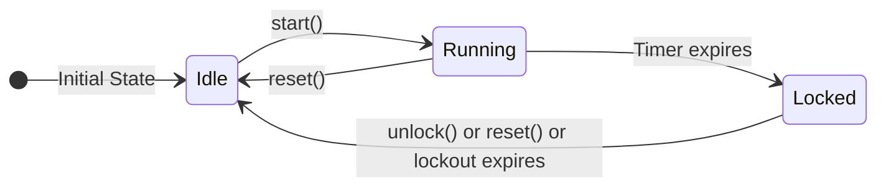

# useTimer Hook

## 📌 Overview

The `useTimer` hook is the **core state management** component of the Timer Lockout Application. It encapsulates all timer logic, including the 3-minute countdown and lockout period functionality.

---

## 📁 File Information

| Property | Value |
|----------|-------|
| **File Path** | `/src/hooks/useTimer.ts` |
| **Type** | Custom React Hook |
| **Language** | TypeScript |
| **Lines of Code** | ~200 |
| **Test File** | `/tests/hooks/useTimer.test.tsx` |
| **Test Coverage** | 10 tests |

---

## 🎯 Purpose

The `useTimer` hook provides:

- **Timer State Management**: Centralized state for timer status, time, and button state
- **Timer Logic**: Countdown from 3 minutes with automatic lockout
- **Lockout Functionality**: Prevents automatic restart after timer completes
- **Event System**: Allows components to subscribe to timer events
- **Utility Functions**: Helper functions for progress and time formatting

This hook implements the exact behavior requested: **a timer that turns off for 3 minutes from start, and after that should NOT turn on back until a button is pressed**.

---

## 🏗️ Hook Structure

```
useTimer Hook
├── State Management
│   ├── status: TimerStatus
│   ├── remainingTime: number
│   ├── startTime: number | null
│   ├── lockoutEndTime: number | null
│   └── isButtonEnabled: boolean
├── Actions
│   ├── start()
│   ├── pause()
│   ├── reset()
│   ├── unlock()
│   └── subscribe()
├── Utilities
│   ├── getProgress()
│   └── getFormattedTime()
├── Effects
│   ├── Timer interval (100ms)
│   └── Lockout check interval (1s)
└── Event System
    ├── eventListeners: Set<Function>
    ├── emitEvent()
    └── subscribe()
```

---

## 📦 Return Value

### Return Type

```typescript
{
  state: TimerState;
  start: () => void;
  pause: () => void;
  reset: () => void;
  unlock: () => void;
  subscribe: (callback: (event: TimerEvent) => void) => () => void;
  getProgress: () => number;
  getFormattedTime: () => string;
}
```

### State Interface

```typescript
interface TimerState {
  status: TimerStatus;           // Current timer status
  remainingTime: number;         // Time remaining in seconds
  startTime: number | null;      // When timer started (Date.now())
  lockoutEndTime: number | null; // When lockout ends (Date.now() + duration)
  isButtonEnabled: boolean;      // Whether action button is enabled
}

type TimerStatus = 'idle' | 'running' | 'locked' | 'completed';
```

---

## 🎛️ Actions

### start()

**Purpose**: Start the timer countdown

**Behavior**:
1. Clears any existing timer interval
2. Sets status to 'running'
3. Sets startTime to current timestamp
4. Sets isButtonEnabled to false
5. Starts 100ms interval to update remaining time
6. Emits 'START' event

**Preconditions**:
- Timer must be in 'idle' or 'locked' state (isButtonEnabled === true)

**Side Effects**:
- Starts browser interval
- Emits 'START' event
- UI updates to show running timer

**Example**:
```typescript
const { start } = useTimer();

<Button onClick={start} disabled={!state.isButtonEnabled}>
  Start Timer
</Button>
```

---

### pause()

**Purpose**: Pause the timer countdown

**Behavior**:
1. Clears the timer interval
2. Sets status to 'idle'
3. Sets startTime to null
4. Sets isButtonEnabled to false
5. Emits 'PAUSE' event

**Preconditions**:
- Timer must be in 'running' state

**Side Effects**:
- Clears browser interval
- Emits 'PAUSE' event
- UI updates to show paused state

**Note**: This action is not currently used in the application but is available for future use.

---

### reset()

**Purpose**: Reset the timer to initial state

**Behavior**:
1. Clears any existing timer interval
2. Sets status to 'idle'
3. Sets remainingTime to lockoutDuration (default: 180)
4. Sets startTime to null
5. Sets lockoutEndTime to null
6. Sets isButtonEnabled to true
7. Emits 'RESET' event

**Preconditions**: None (can be called from any state)

**Side Effects**:
- Clears browser interval
- Emits 'RESET' event
- UI updates to show ready state

**Example**:
```typescript
const { reset } = useTimer();

<Button onClick={reset} disabled={!state.isButtonEnabled}>
  Reset Timer
</Button>
```

---

### unlock()

**Purpose**: Force unlock the timer (bypass lockout)

**Behavior**:
1. Clears any existing timer interval
2. Sets status to 'idle'
3. Sets remainingTime to lockoutDuration
4. Sets startTime to null
5. Sets lockoutEndTime to null
6. Sets isButtonEnabled to true
7. Emits 'LOCKOUT_END' event

**Preconditions**: None (can be called from any state)

**Side Effects**:
- Clears browser interval
- Emits 'LOCKOUT_END' event
- UI updates to show ready state

**Note**: This is essentially the same as reset() but emits a different event.

---

## 📡 Event System

### Event Types

```typescript
type TimerEvent = 
  | { type: 'START' }
  | { type: 'PAUSE' }
  | { type: 'RESET' }
  | { type: 'COMPLETE' }
  | { type: 'LOCKOUT_START' }
  | { type: 'LOCKOUT_END' };
```

### subscribe(callback)

**Purpose**: Subscribe to timer events

**Parameters**:
- `callback`: Function to call when events occur

**Returns**: Unsubscribe function

**Behavior**:
- Adds callback to event listeners set
- Returns function to remove callback
- Callbacks are called with TimerEvent parameter

**Example**:
```typescript
const { subscribe } = useTimer();

useEffect(() => {
  const unsubscribe = subscribe((event) => {
    console.log('Timer event:', event.type);
    
    switch (event.type) {
      case 'START':
        console.log('Timer started');
        break;
      case 'COMPLETE':
        console.log('Timer completed');
        break;
      case 'LOCKOUT_START':
        console.log('Lockout started');
        break;
      case 'LOCKOUT_END':
        console.log('Lockout ended');
        break;
    }
  });

  return () => unsubscribe();
}, [subscribe]);
```

### Event Emission

The hook emits events at key points:

| Event | Emitted When | Purpose |
|-------|--------------|---------|
| START | Timer starts | Notify that timer has started |
| PAUSE | Timer pauses | Notify that timer has paused |
| RESET | Timer resets | Notify that timer has reset |
| COMPLETE | Timer reaches 0 | Notify that timer has completed |
| LOCKOUT_START | Lockout begins | Notify that lockout has started |
| LOCKOUT_END | Lockout ends | Notify that lockout has ended |

---

## 📊 Utilities

### getProgress()

**Purpose**: Get the timer progress as a percentage (0-100)

**Returns**: number (0-100)

**Calculation**:
```typescript
if (status !== 'running' || lockoutDuration <= 0) {
  return 0;
}
const elapsed = lockoutDuration - remainingTime;
return (elapsed / lockoutDuration) * 100;
```

**Example**:
```typescript
const { getProgress } = useTimer();
const progress = getProgress(); // 0-100

<ProgressRing progress={progress} />
```

---

### getFormattedTime()

**Purpose**: Get the remaining time as a formatted string

**Returns**: string (MM:SS format)

**Calculation**:
```typescript
if (status === 'locked') {
  return '00:00';
}
const mins = Math.floor(remainingTime / 60);
const secs = Math.floor(remainingTime % 60);
return `${mins}:${String(secs).padStart(2, '0')}`;
```

**Example**:
```typescript
const { getFormattedTime } = useTimer();
const timeString = getFormattedTime(); // e.g., "2:30", "0:00"

<TimerDisplay time={state.remainingTime} status={state.status} />
```

---

## ⚙️ Configuration

### Default Lockout Duration

**Default**: 180 seconds (3 minutes)

**Environment Variable**: `VITE_LOCKOUT_DURATION`

**Usage**:
```typescript
// In useTimer.ts
const DEFAULT_LOCKOUT_DURATION = 180;

// Can be customized via environment
export function useTimer(lockoutDuration: number = DEFAULT_LOCKOUT_DURATION) {
  // ...
}
```

**Example**:
```typescript
// Use default (3 minutes)
const { state } = useTimer();

// Use custom duration (5 minutes)
const { state } = useTimer(300);
```

---

## 🔄 State Transitions

### State Transition Diagram



### State Transition Table

| Current | Action | Next | Conditions |
|---------|--------|------|------------|
| idle | start() | running | isButtonEnabled === true |
| idle | reset() | idle | Always |
| idle | unlock() | idle | Always |
| running | start() | running | Ignored (isButtonEnabled === false) |
| running | reset() | idle | Always |
| running | unlock() | idle | Always |
| running | Timer expires | locked | remainingTime <= 0 |
| locked | start() | locked | Ignored (isButtonEnabled === false) |
| locked | reset() | idle | Always |
| locked | unlock() | idle | Always |
| locked | Lockout check | idle | Date.now() >= lockoutEndTime |

---

## 🧪 Testing

### Test File: `/tests/hooks/useTimer.test.tsx`

**Total Tests**: 10

**Test Coverage**:
- ✅ Initialization with idle status
- ✅ Start timer when start is called
- ✅ Count down remaining time
- ✅ Transition to locked status when timer completes
- ✅ Enable button after lockout period
- ✅ Reset timer to initial state
- ✅ Return correct progress percentage
- ✅ Return formatted time string
- ✅ Emit events when subscribed
- ✅ Clear timer on unmount

**Example Test**:
```typescript
it('should initialize with idle status', () => {
  const { result } = renderHook(() => useTimer());
  
  expect(result.current.state.status).toBe('idle');
  expect(result.current.state.remainingTime).toBe(180);
  expect(result.current.state.isButtonEnabled).toBe(true);
});

it('should start timer when start is called', () => {
  const { result } = renderHook(() => useTimer());
  
  act(() => {
    result.current.start();
  });

  expect(result.current.state.status).toBe('running');
  expect(result.current.state.isButtonEnabled).toBe(false);
  expect(result.current.state.startTime).not.toBeNull();
});

it('should transition to locked status when timer completes', () => {
  const { result } = renderHook(() => useTimer(2)); // 2 second timer
  
  act(() => {
    result.current.start();
  });

  // Advance time by 2.1 seconds (21 intervals of 100ms)
  for (let i = 0; i < 21; i++) {
    act(() => {
      vi.advanceTimersByTime(100);
    });
  }

  expect(result.current.state.status).toBe('locked');
  expect(result.current.state.isButtonEnabled).toBe(false);
});
```

---

## 🏗️ Implementation Details

### File: `/src/hooks/useTimer.ts`

```typescript
import { useState, useEffect, useCallback, useRef } from 'react';
import type { TimerState, TimerEvent } from '@/types';

const DEFAULT_LOCKOUT_DURATION = 180; // 3 minutes in seconds

export function useTimer(lockoutDuration: number = DEFAULT_LOCKOUT_DURATION) {
  const [state, setState] = useState<TimerState>({
    status: 'idle',
    remainingTime: lockoutDuration,
    startTime: null,
    lockoutEndTime: null,
    isButtonEnabled: true,
  });

  const timerRef = useRef<number | null>(null);
  const eventListeners = useRef<Set<(event: TimerEvent) => void>>(new Set());

  // ... actions (start, pause, reset, unlock)
  
  // ... event system (subscribe, emitEvent)
  
  // ... utilities (getProgress, getFormattedTime)
  
  // Lockout check effect
  useEffect(() => {
    if (state.status === 'locked' && state.lockoutEndTime) {
      const checkLockout = () => {
        const now = Date.now();
        if (now >= state.lockoutEndTime!) {
          unlock();
        }
      };

      const interval = window.setInterval(checkLockout, 1000);
      checkLockout(); // Check immediately

      return () => window.clearInterval(interval);
    }
  }, [state.status, state.lockoutEndTime, unlock]);

  // Cleanup effect
  useEffect(() => {
    const listeners = eventListeners.current;
    return () => {
      clearTimer();
      listeners.clear();
    };
  }, [clearTimer]);

  return {
    state,
    start,
    pause,
    reset,
    unlock,
    subscribe,
    getProgress,
    getFormattedTime,
  };
}

export default useTimer;
```

---

## 🔌 Integration

### Dependencies

| Dependency | Purpose | Location |
|------------|---------|----------|
| React | Hooks API (useState, useEffect, useCallback, useRef) | External |
| TimerState | Type definition | `@/types` |
| TimerEvent | Type definition | `@/types` |

### Consumers

The useTimer hook is used by:
- `App.tsx` (main application component)

### Exports

The hook is exported from:
- `/src/hooks/useTimer.ts` (default export)
- `/src/hooks/index.ts` (named export)

**Import Paths**:
```typescript
// Default import
import useTimer from '@/hooks/useTimer';

// Named import
import { useTimer } from '@/hooks';
```

---

## ⚡ Performance

### Memory Usage

- **State**: Single state object (5 properties)
- **Refs**: 2 refs (timerRef, eventListeners)
- **Intervals**: 1-2 intervals (timer, lockout check)

### CPU Usage

- **Timer Interval**: 100ms (10 times per second)
- **Lockout Check**: 1000ms (1 time per second when locked)
- **Overhead**: Minimal (simple calculations)

### Cleanup

- ✅ Intervals cleared on unmount
- ✅ Event listeners cleared on unmount
- ✅ No memory leaks

---

## 🛡️ Error Handling

The useTimer hook handles errors gracefully:

- **Event Listener Errors**: Wrapped in try/catch to prevent one listener from affecting others
- **Interval Errors**: Browser handles interval errors
- **Invalid Inputs**: TypeScript prevents invalid inputs at compile time
- **Edge Cases**: Handled with safe defaults

**Example** (Event Listener Error Handling):
```typescript
const emitEvent = useCallback((event: TimerEvent) => {
  eventListeners.current.forEach(listener => {
    try {
      listener(event);
    } catch (error) {
      console.error('Error in timer event listener:', error);
    }
  });
}, []);
```

---

## 📝 Best Practices

### When to Use

✅ **Use useTimer hook when**:
- You need timer functionality
- You need lockout functionality
- You need to react to timer events
- You need consistent timer behavior

### When Not to Use

❌ **Don't use useTimer hook when**:
- You need a simple countdown without lockout
- You need multiple independent timers (create separate instances)
- You need timer functionality that doesn't match this pattern

### Usage Tips

- Use the event system for side effects
- Don't modify state directly, use the provided actions
- Use the utilities (getProgress, getFormattedTime) for derived values
- Clean up subscriptions when unmounting

---

## 🔄 Modification Risks

### Safe to Modify

- Lockout duration default value
- Interval timing (100ms, 1000ms)
- Adding new events
- Adding new utilities

### Risky to Modify

- State structure (may break consumers)
- Action behavior (may break expected functionality)
- Event types (may break subscribers)

### Do Not Modify

- State immutability (always create new state objects)
- Cleanup logic (may cause memory leaks)
- Type definitions (may break type safety)

---

## 📚 Related Documentation

- [ARCHITECTURE.md](../ARCHITECTURE.md) - Architecture overview
- [PROJECT_STRUCTURE.md](../PROJECT_STRUCTURE.md) - Project structure
- [types/index.ts](/src/types/index.ts) - Type definitions
- [App.tsx](/src/App.tsx) - Main application component
- [TESTING.md](../TESTING.md) - Testing strategy
- [state-management.md](./state-management.md) - State management details
